### Chapter 3 上下文无关文法(CFG)及分析

##### 语法树

语法树的结构在很大程度上依赖于语言特定的语法结构。这种树通常被定义为动态数据结构，该结构中的每个节点都由一个记录组成，而这个记录的域包括了编译后面过程所需的特性。

##### 推导(Derivation)

推导是在文法规则的右边进行选择的一个结构名字替换序列。 推导以一个结构名字开始并以记号符号串结束。在推导的每一个步骤中，使用来自文法规则的选择每一次生成一个替换。  

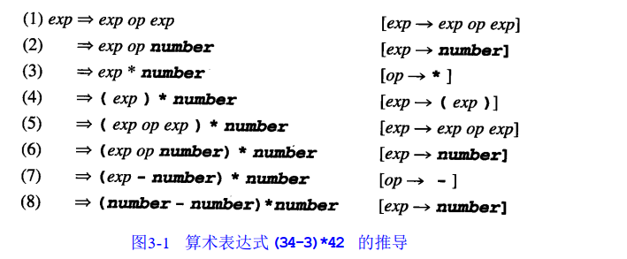

由推导从起始符号中得到的所有记号符号的串集是被表达式的文法定义的语言。

$L(G)=\{s|exp=>*s\}$

##### 例1：考虑下面语句的极为简化的文法

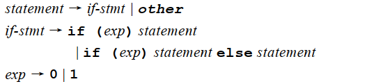

推导产生的串有：

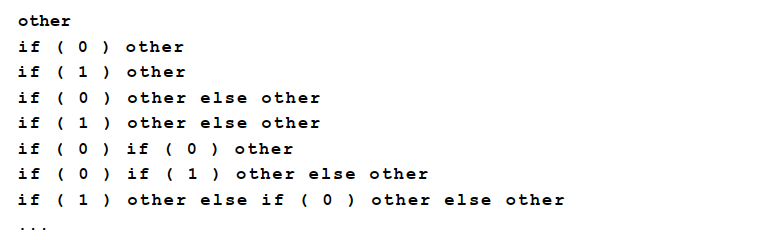

##### 例2：考虑下列文法

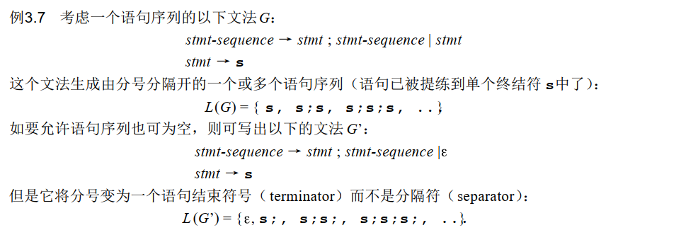

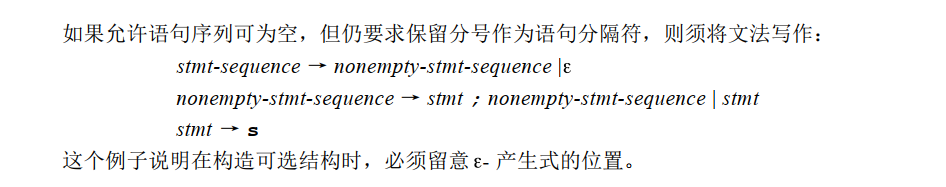

#### 3.3 分析树与抽象语法树

##### 最左推导

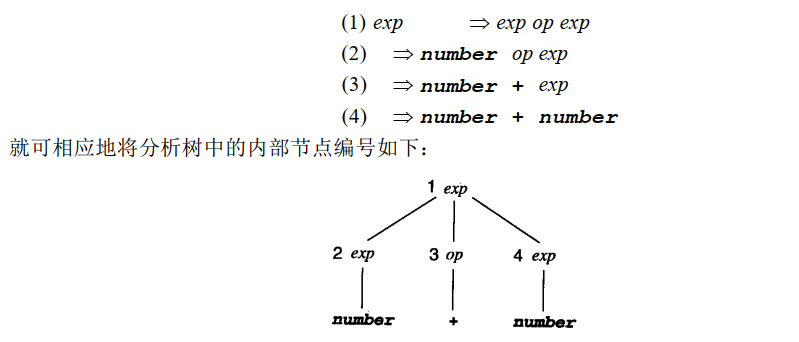

#### 3.4 二义性

文法有可能允许一个串有多于一个的分析树。

例如在前面作为标准示例的简单整型算术文法中 ：

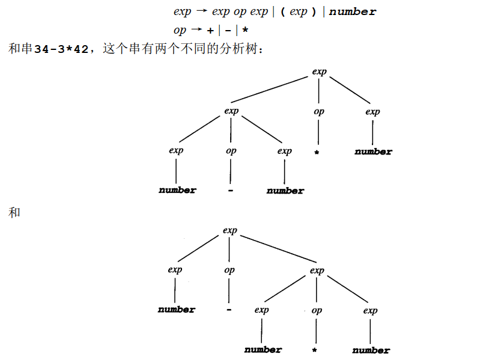

可生成带有两个不同分析树的串的文法称作二义性文法***（ambiguous grammar）***

##### 二义性产生的原因

- 优先级
- 结合律

##### 解决二义性的方法

- 设置规则
- 修改文法

##### 例：运算文法

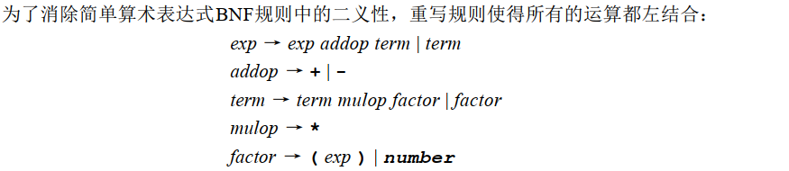

之所以不采取$exp~~addop~~exp$是因为算符两边的递归都允许每一边匹配推导（因此也在分析树和语法树）中的算符重复，会产生二义性。

##### 左递归会产生左结合

##### 悬挂else问题

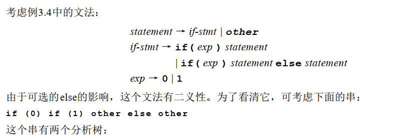

语法树1：

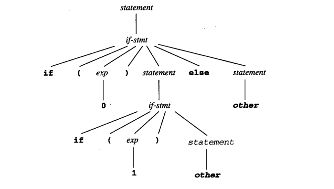

语法树2：

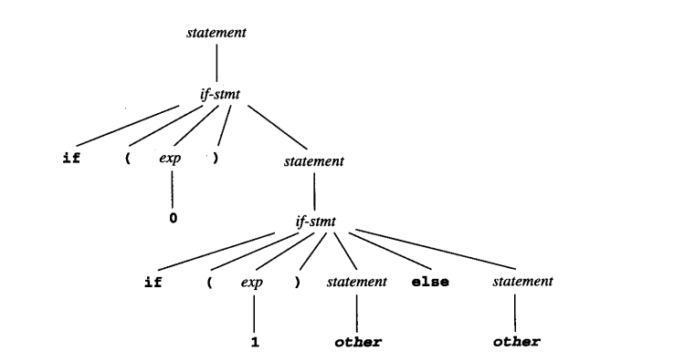

修改后的文法：

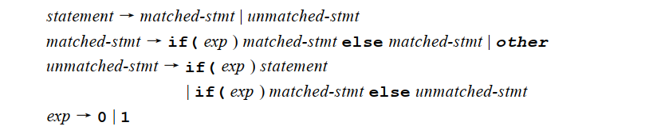

#### 3.5 EBNF和语法图

##### 闭包

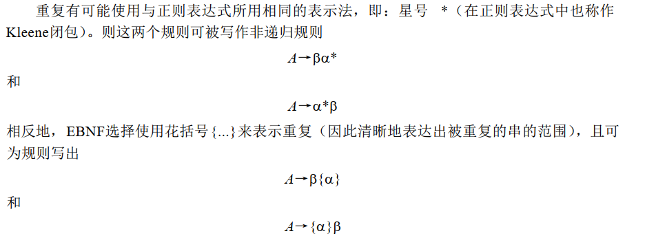

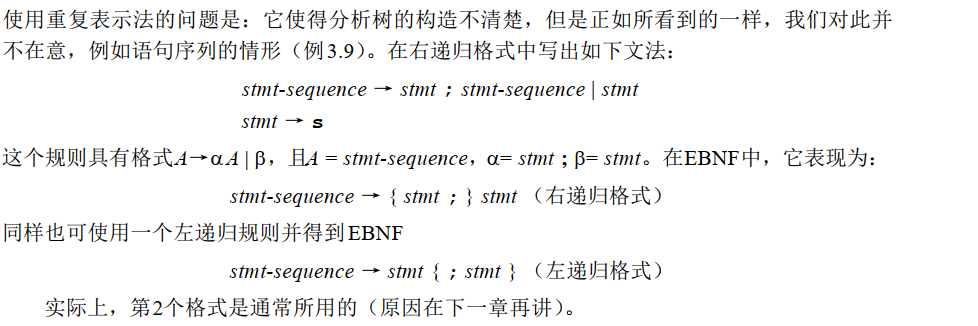

##### 选择

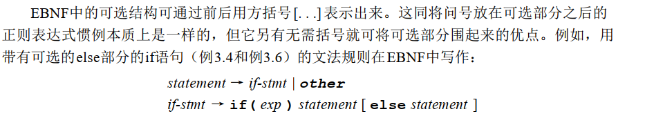

