### Chapter 8 代码生成

##### 目标

用来生成目标机器的可执行代码，这个可执行代码是源代码语义的忠实体现。  

代码生成是编译器最复杂的阶段，因为它不仅依赖于源语言的特征，而且还依赖于目标结构、运行时环境的结构和运行在目标机器的操作系统的细节信息。通过收集源程序进一步的信息，并通过定制生成代码以便利用目标机器，如寄存器、寻址模式、管道和高速缓存的特殊性质，代码生成通常也涉及到了一些优化或改善的尝试。  

##### 中间代码的形式

- 三地址码(three address code)
- P-Code

#### 8.1 中间代码 (*itermediate code*)

##### 定义

从语法树生成的一个更接近目标代码的中间表示形式，然后再从这个新的中间表示生成目标代码。  

##### 三地址码：跟TINY相关

$x~~=~~y~~OP~~z$

###### 例1：

表达式：$2*a+(b-3)$

$T1=2*a,~~T2=b-3,~~T3=T1+T2$

会产生形如T1、T2、T3的临时变量，它可以存放在活动记录中，有时候也可能会存在于寄存器中

###### 例2：

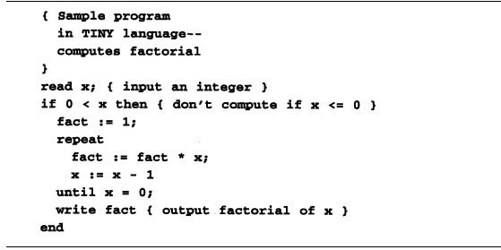

转换成三地址码后

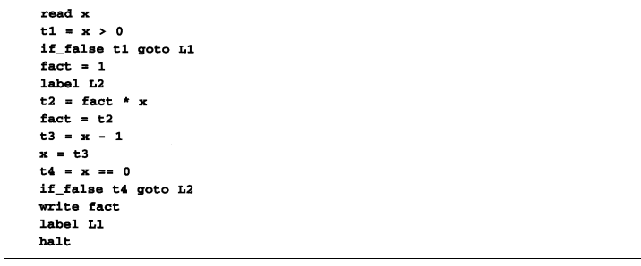

- 内置的输入和输出操作符read和write已被直接翻译成一地址指令
- 条件转移指令***if_false***，它通常被用来翻译if语句和循环语句，它包含被检测的条件值和转移的代码地址

##### 三地址码的数据结构

三地址码通常不被实现成我们所写的文本形式 (虽然这是可能的)，相反是将其实现为包含几个域的记录结构。并将整个三地址指令序列实现成链表或数组，它能被保存在内存中并在需要时可以从临时文件中读写。

三地址码的四元组：3个地址+1个操作符

三地址码的表示：

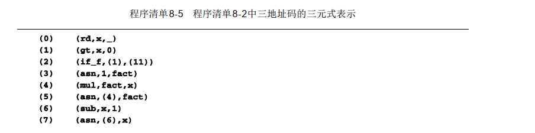

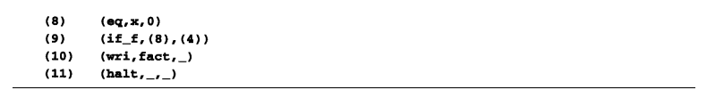

PS：(2)中的(1)表示引用(1)式的结果

数据结构定义：

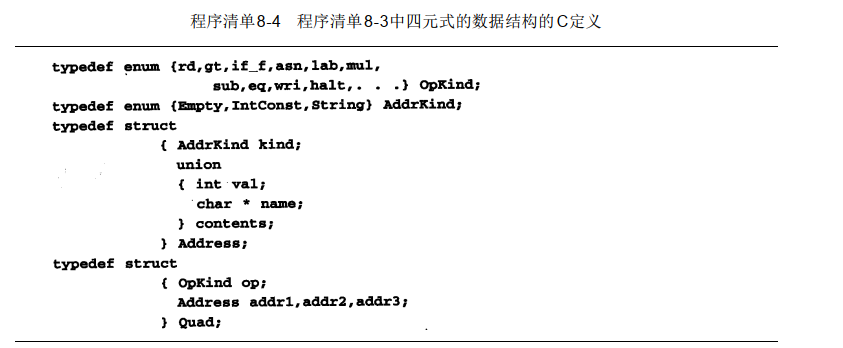

##### P-Code与Pascal密切相关

###### 例1：

表达式：$2*a+(b-3)$

这个表达式的P-Code版本如下：  

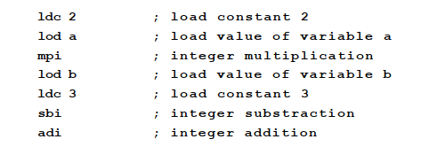

这些指令被看作代表如下的P-机器操作：ldc2首先将值2压入临时栈，然后，loda将变量a的值压入栈。指令mpi将这两个值从栈中弹出，使之相乘(按弹出的相反顺序)，再将结果压入栈。接下来两个指令(loab和ldc3)将b的值和常量3压入栈(现在栈中有3个值)，随后，sbi指令弹出栈顶的两个值，用第1个值去减第2个值，再把结果压入栈中，最后adi指令弹出余下的两个值并使之相加，再将结果压入栈。代码结束时，栈中只有一个值，它代表了这次运算的结果。

###### 例2：

`x := y + 1`

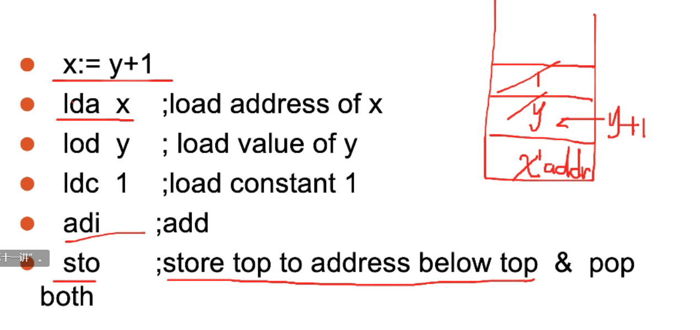

常见的P-Code及其含义

| 指令 | 含义                                                    |
| ---- | ------------------------------------------------------- |
| lod  | 加载值                                                  |
| ldc  | 加载常数                                                |
| grt  | ＞                                                      |
| lda  | 加载地址                                                |
| sbi  | 整数减法                                                |
| sto  | 将栈顶的值赋值到栈顶下面一个元素(地址)的值中，并全部Pop |
| adi  | 整数加法                                                |
| mpi  | 整数乘法                                                |
| rdi  | 读入                                                    |
| stn  | 与sto类似，但是会将表达式的值留在栈中                   |
| ind  | 间接装载，  ind i   => *(a+i)                           |
| ixa  | 索引寻址，ixa s => a + s * i                            |
| fjp  | false then jump                                         |
| ujp  | 无条件跳转                                              |
| neq  | 不相等判定                                              |
| equ  | 相等判定                                                |
|      |                                                         |
|      |                                                         |
|      |                                                         |

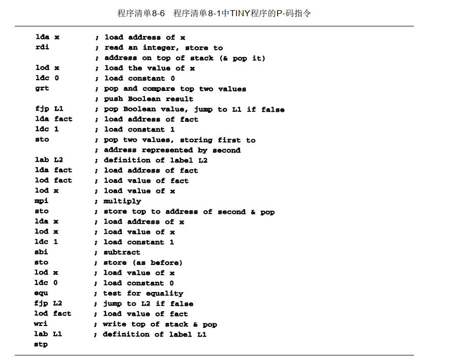

#### 8.2 基本的代码生成技术

中间代码生成(或没有中间代码的直接目标代码生成)能被看作是一个属性计算。

##### 作为合成属性的中间代码或目标代码

###### 例：

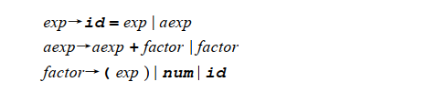

##### P-Code的生成算法

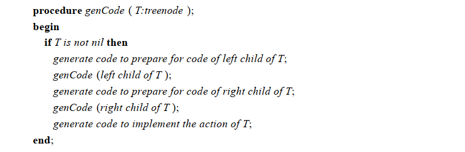

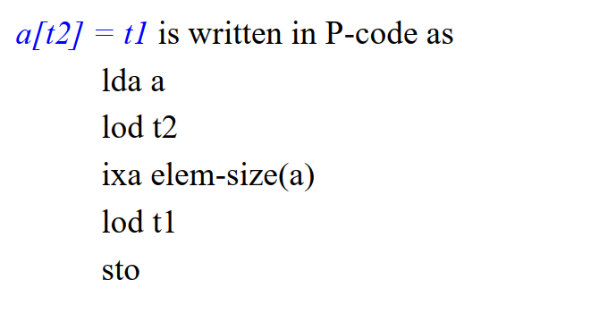

### 三地址码模板

##### IF

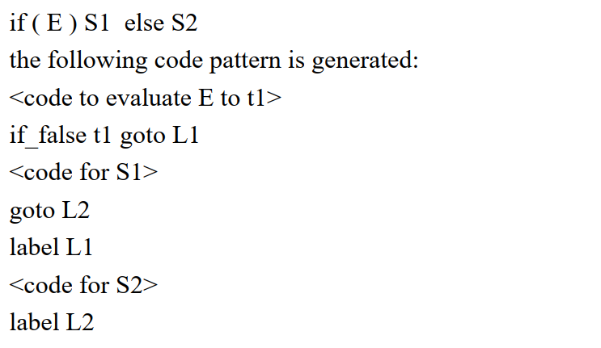

##### WHILE

### P-Code模板

##### IF

##### WHILE

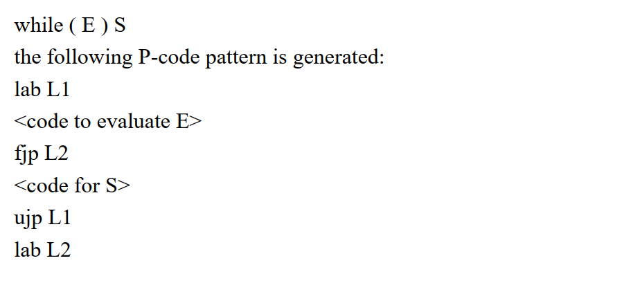

### 逻辑表达式

##### 短路模板

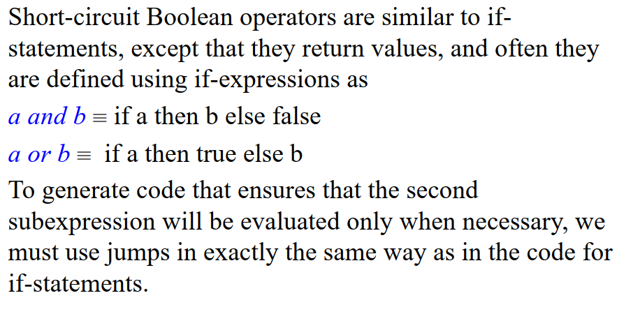

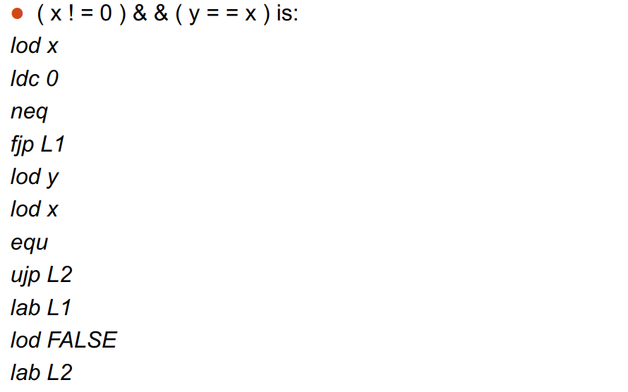