### Chapter 5 自底向上的分析

##### 自底向上的分析程序可能的动作

- Shift：将终结符从输入的开头移入到分析栈的顶部
- Reduce：假设有BNF选择$A→\alpha$，将栈顶部的串$\alpha$规约为$A$

##### 增广文法

如果$S$是开始符号，并且文法中存在$S$的两个不同推导：$S→P,S→Q$，为了保持规约目标的一致性，需要再文法中增加一条$S'→S$，以保证只有一个可能的从$S$规约到$S'$的路径

##### 右句型

移进-归约分析程序描绘出输入串的最右推导,但推导步骤的顺序却是颠倒的

- 因为最右推导是从右向左依次替换
- 而在规约时，可以从左到右进行扫描规约，这样使得先被规约的是位于左边的串，也就是后被推导的串

考虑文法：$E'→E,~~E→E+n~|~n$ 和句子$n+n$

存在如下推导：$E'=>E=>E+n=>n+n$

我们将这样的推导中的终结符和非终结符的每个中间串都称作右句型**(*right sentential form*)**

在移入规约分析中，每一个这样的句型都被分析栈和输入符分隔开：

- 可行前缀就是分析栈中可能的值

- 因此$E,E+,E+n$是$n+n$的可行前缀
- 而$n+$不是$n+n$的可行前缀

##### 句柄(handle)

移进-归约分析程序将终结符从输入移进到栈直到它能执行一个归约以得到下一个右句子格式

它发生在位于栈顶部的符号串匹配用于下一个归约的产生式的右边

这个串、它在右句子格式中发生的位置以及用来归约它的产生式被称作右句型的句柄 

例如在右句型$n+n$中，它的句柄是由左边的$n$和用来规约它以产生新的右句型$E+n$的产生式$E→n$组成的串。

#### 5.2 LR(0)分析

##### LR(0)项

如果$A→\alpha$是产生式，且$\beta,~\gamma$是符号的任何两个串，包括空串，且存在$\alpha=\beta\gamma$，那么$A→\beta·\gamma$就是LR(0)项

###### 例1：考虑如下文法

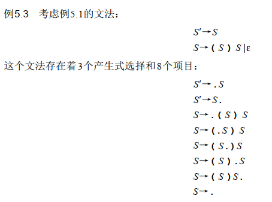

##### 项目的有穷自动机

如果$X$是一个$token$，那么该转换与$X$的一个移入操作相对应：

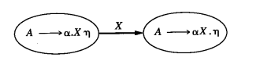

如果$X$是一个非终结符，因为$X$永远不会作为输入符号出现（只能够通过规约得到），当且仅当在规约前识别到串$\beta$且存在产生式$X→\beta$，才会进行一次规约操作。也就是在这个时候，状态机应该切换到另一个状态：

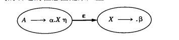

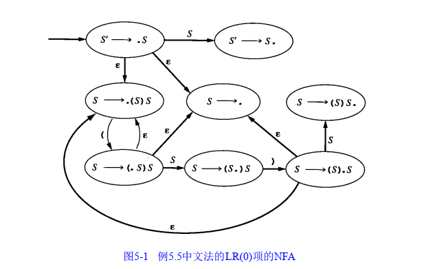

直接构建DFA

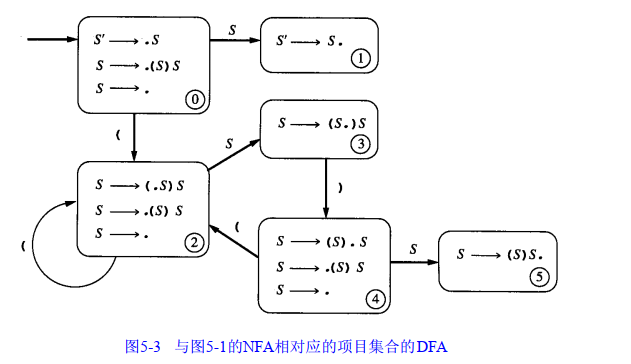

###### 例1：考虑文法$A→(A)~|~a$

DFA：

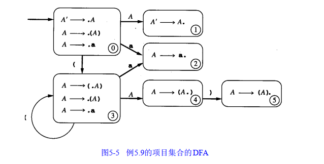

分析动作：

分析表：

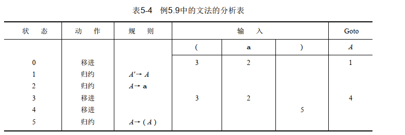

简化的分析表：

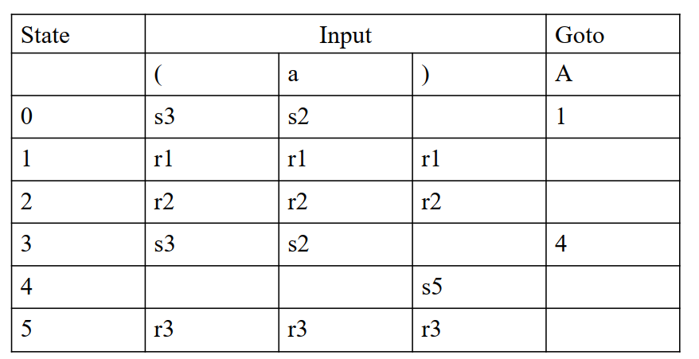

#### 5.3 SLR(1)分析

##### 定义

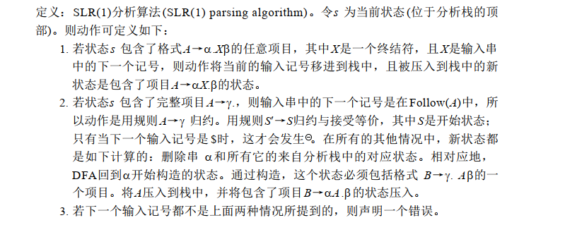

##### 与LR(0)的区别

- LR(0)是无条件做规约，它不往前看。不知道规约后的结果是否正确，并且，当一个规约的状态中存在两个完整项时或者同时存在移入项和规约项，LR(0)就会产生歧义，不能够知道到底采取哪一种规约方法。
- LR(1)在规约前会判定，下一个$token$必须在$Follow(A)$中，因为只有这样，规约后的结果才是有意义的。

##### SLR(1)的判定

当且仅当对于任何状态$s$，满足以下两个状态：

- 判断是否具有移入-规约冲突：如果状态中有移入项，那么可以同时存在完整项，前提是这个完整项没法规约，否则就会产生移入-规约冲突。即对于$A→\alpha·X\beta$，这里的$X$是终结符，不存在完整项$B→\gamma·$，使得$X$在$Follow(B)$中。
- 判断是否具有规约-规约冲突：如果在一个状态中有两个完整项，那么这两个完整项的$Follow$集合应该是不相交集。

##### 例：考虑文法 $E'→E, E→E+n~|~n$

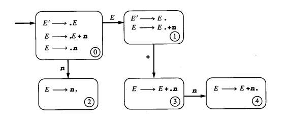

该文法不是LR(0)文法，因为在状态1中同时具有移入项和规约项，会产生移入-规约冲突。

该文法是SLR(1)文法，因为$Follow(E')={$}$，不包含$+$号，因此不会产生移入-规约冲突。

该文法的SLR分析表

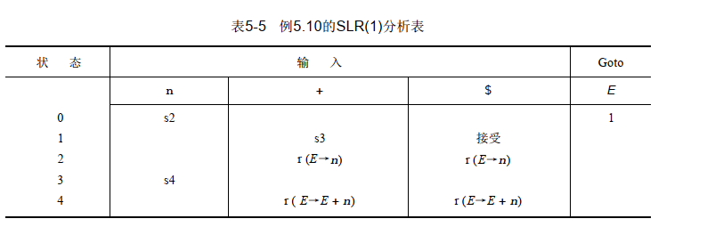

#### 5.4.1 LR(1)分析

##### LR(1)项

LR(1)项是由由LR(0)项和一个先行记号组成的对。利用中括号将LR(1)项写作：$[A→\alpha·\beta,~a]$

它表示，当下一个输入为$a$时，会进行规约

##### LR(1)自动机的转换

- 假设有LR(1)的项$[A→\alpha·X\gamma,~a]$，其中$X$是任意符号，那么$X$就有一个到$[A→\alpha X·\gamma,~a]$的转换
- 假设有LR(1)的项$[A→\alpha·B\gamma,~a]$，其中$B$是非终结符，那么对于每一个产生式$B→\beta$和在$First(\gamma a)$中的每一个记号$b$，都有到项目$[B→·\beta,~b]$的转换
  - 其言下之意是，如果B是非终结符，那么下一个可能导致归约的符号要么在$First(\gamma)$中，要么是$a$

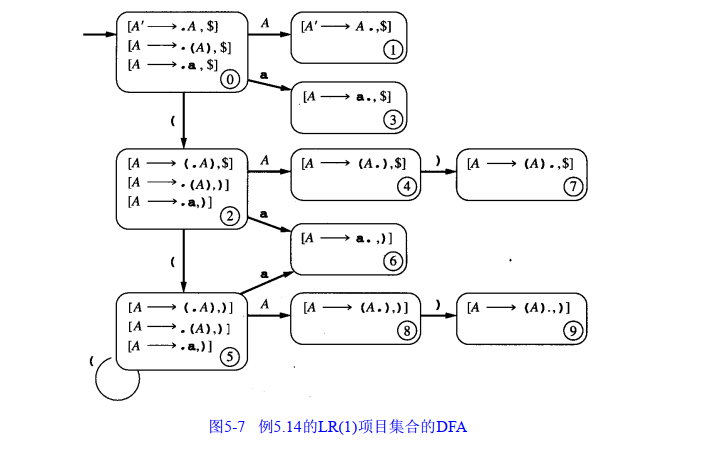

##### LR(1)的分析算法

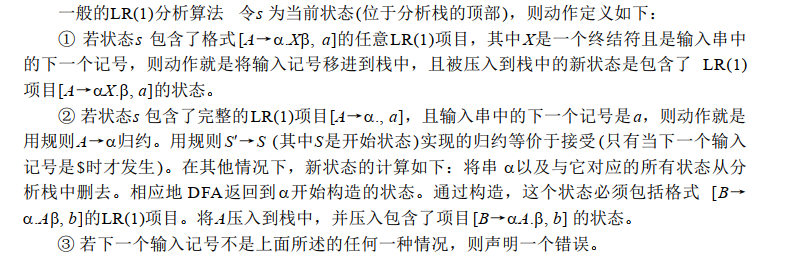

##### LR(1)文法的条件

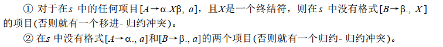

##### 例：文法$A→(A)~|~a$ 的LR(1)分析表

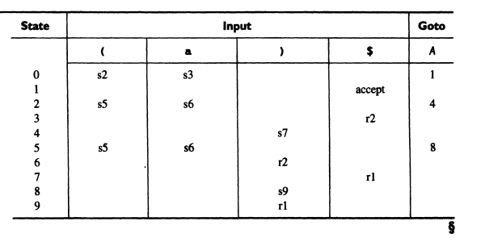

#### 5.4.2 LALR(1)分析

LALR(1)通过识别具有相同核心的所有状态进行合并，来减少DFA的状态数

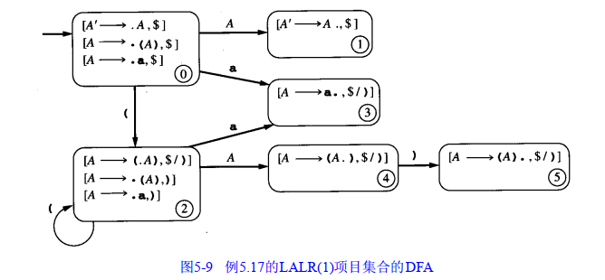

##### LALR文法的歧义性

- 如果一个文法是SLR(1)的，那么它肯定是LALR(1)的
- 如果一个文法是LR(1)的，其对应的LALR(1)分析表不可能会有移入-规约冲突但是可能有规约-规约冲突

##### 文法的分析能力

$LR(1)>LALR(1)>SLR(1)>LR(0)$

