#### 4.2 LL(1)文法

LL(1)分析使用显式栈而不是递归调用来完成分析

假设有文法$S→(S)S|ε$，则其分析栈为：

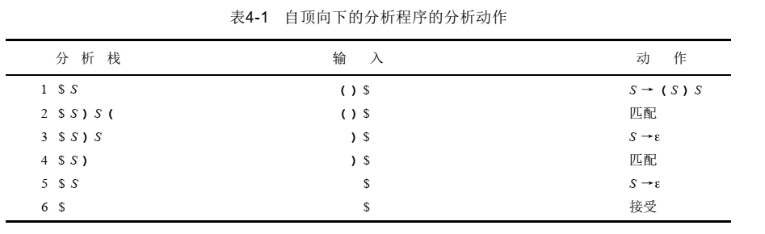

当非终结符A位于分析栈的顶部时，根据当前的输入记号（先行），必须使用刚刚描述过的分析办法做出一个决定：当替换栈中的A时应为A选择哪一个文法规则。

##### LL(1)分析

分析表$M[N,T]$，$N$表示非终结符，$T$表示终结符

根据以下规则在这个表中添加产生式：

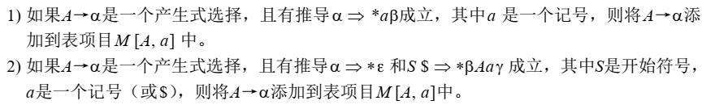

- 第1条指出，在输入中给出了记号$a$，如果$\alpha$能够匹配生成一个$a$，则希望挑选规则$A→\alpha$
- 第2条指出，如果经过$A$推导后能够产生空串，且如果$a$是在一个推导中可以合法地给出现在$A$后面的记号，则要挑选$A→\alpha$使$A$消失

**如果文法G相关的LL(1)分析表每项中至多只有一个产生式，则该文法是LL(1)的**

##### 消除左递归

###### 简单的直接左递归

$A→A\alpha~|~\beta$

替换后：

$A→\beta A'$

$A'→\alpha A'|ε$

###### 普遍的左递归

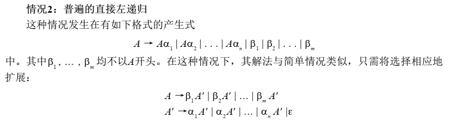

###### 例1：

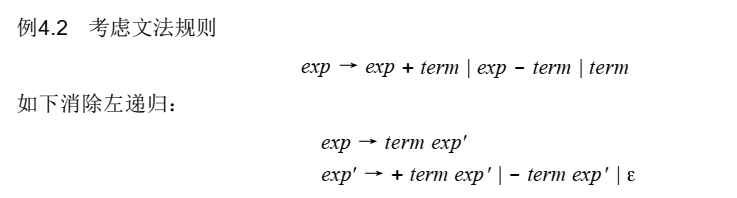

###### 一般的左递归

为语言的所有非终结符选择任意的顺序，如$A_1,A_2,...,A_m$，接着再消除形如$A_i→A_j$的左递归，其中$j<=i$。

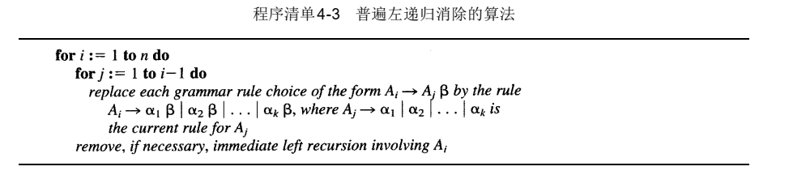

例：

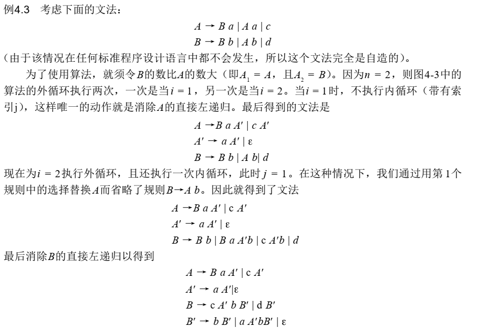

##### 提取左公因子

形如$A→\alpha \beta~|~\alpha\gamma$

提取后变成$A→\alpha A'~~,~~A'→\beta~|~\gamma$

##### 构造语法树

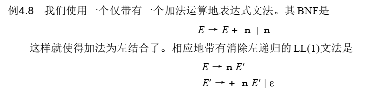

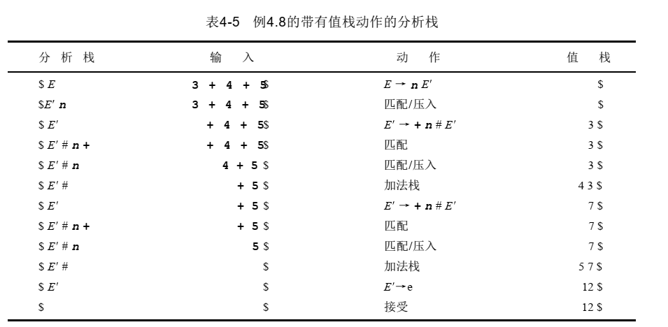

#### 4.3 First和Follow集合

##### First集合

令$X$为一个文法符号或者$\varepsilon$，则集合$First(X)$由终结符组成，此外还有可能有$\varepsilon$：

- 若$X$为终结符，则$First(X)=\{X\}$
- 若$X$为非终结符，则对于每一个产生式$X→X_1X_2...X_n$，$First(X)$都包含了$F(X_1)-\{\varepsilon\}$。对于每一个$i>=2$，如果对于所有的$k=1,...,i-1$，$First(X_k)$包括了$\varepsilon$，则$First(X)$就包括了$First(X_i)-\{\varepsilon\}$，若所有的集合都包括了$\varepsilon$，则$First(X)$也包括了$\varepsilon$

###### 例1：考虑如下文法

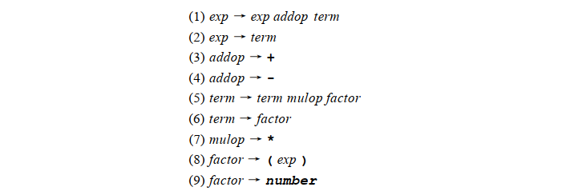

其$First$集合为：

$First(exp)=\{(,number\}$

$First(term)=\{(,number\}$

$First(factor)=\{(,number\}$

$First(addop)=\{+,-\}$

$First(mulop)=\{*\}$

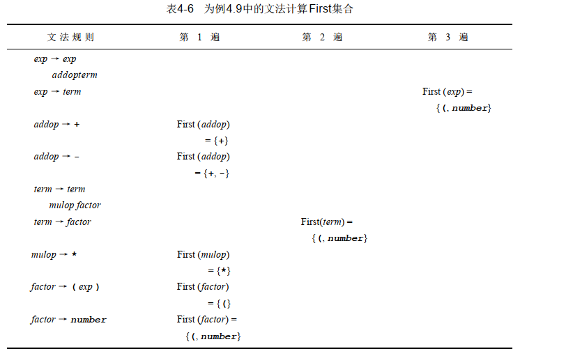

###### 例2：考虑如下文法

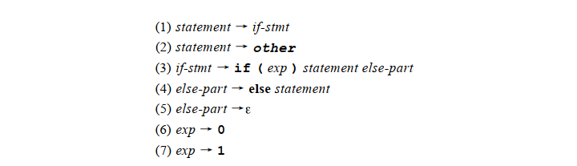

其$First$集合为：

$First(statement)=\{if,other\}$

$First(if-stmt)=\{if\}$

$First(else-part)=\{else,\varepsilon\}$

$First(exp)=\{0,1\}$

##### Follow集合

给出一个非终结符$A$，那么集合$Follow(A)$则由终结符组成，此外可能还有$\$$：

- 若$A$是开始符号，则$\$$就在$Follow(A)$中
- 若存在产生式$B→\alpha A \gamma$，则$First(\gamma)-\{\varepsilon\}$在$Follow(A)$中
- 若存在产生式$B→\alpha A \gamma$，且$\varepsilon$在$First(\gamma)$中，则$Follow(A)$包括$Follow(B)$

PS：$\varepsilon$永远不可能在$Follow$集合中

###### 例1：考虑如下文法

其$Follow$集合为：

$Follow(statement)=\{else,\$\}$

$Follow(if-stmt)=\{else,\$\}$

$Follow(else-part)=\{else,\$\}$

$Follow(exp)=\{)\}$

###### 例2：考虑如下文法

其$First$集合为：

$First(exp)=\{(,number\}$

$First(term)=\{(,number\}$

$First(factor)=\{(,number\}$

$First(addop)=\{+,-\}$

$First(mulop)=\{*\}$

其$Follow$集合为：

$Follow(exp)=\{\$,+,-,)\}$

$Follow(addop)=\{(,number\}$

$Follow(term)=\{\$,+,-,),*\}$

$Follow(mulop)=\{(,number\}$

$Follow(factor)=\{\$,+,-,),*\}$

##### 构造LL(1)分析表

为每个非终结符$A$和产生式$A→\alpha$都重复以下两个步骤：

- 对于$First(\alpha)$中的每一个记号$a$，都将$A→\alpha$添加到$M[A,a]$中
- 若$\varepsilon$在$First(\alpha)$中，则对于$Follow(A)$的每一个元素$a$，都将将$A→\alpha$添加到$M[A,a]$中

##### LL(1)文法的条件

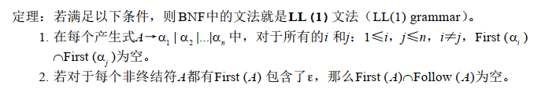

