### Chapter 2 词法分析

#### 2.1 扫描处理

##### 记号(Token)

由扫描程序生成的逻辑单元称作记号。

记号通常定义为枚举类型的逻辑项。

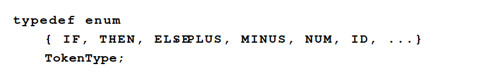

#### 2.3 有穷自动机

有穷自动机可用作描述在输入串中识别模式的过程，因此也能用作构造扫描程序。

###### 例1：`identifier = letter (letter | digit)*`

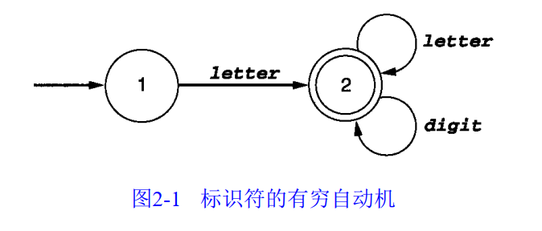

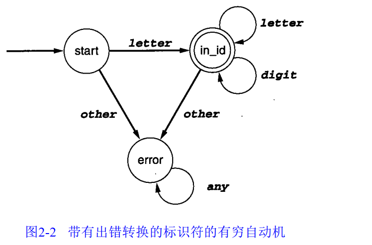

##### DFA定义

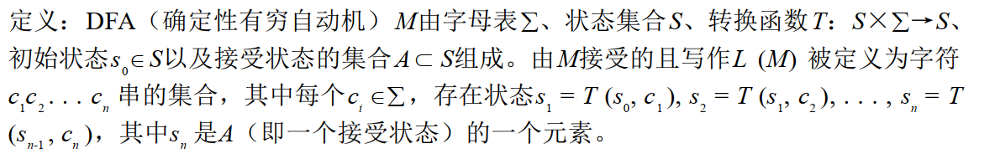

###### 例2：

```
nat = [0-9]+
signedNat = (+|-)?nat
number = signedNat ("." nat) ? (E signedNat)?
```


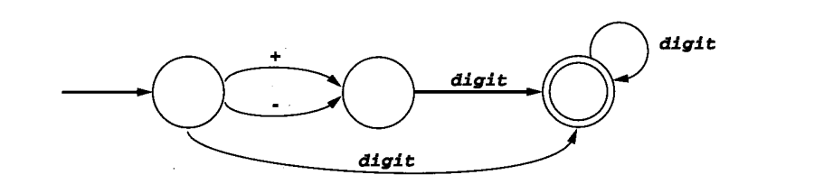

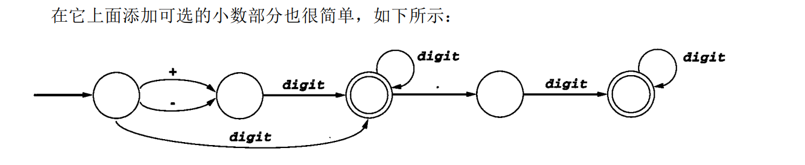

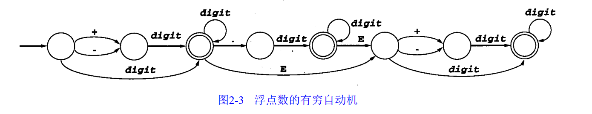

##### ε - 转换

假设有若干个以相同字符开头的记号 ，例如<、< =和< > ，则下面的状态机不是DFA

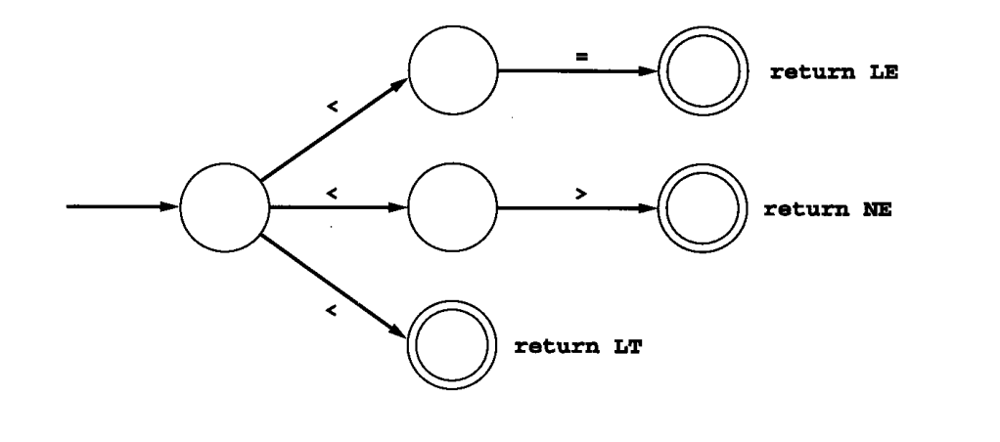

ε - 转换是无需考虑输入串（且无需消耗任何字符）就有可能发生的转换。它可看作是一个空串的“匹配”。

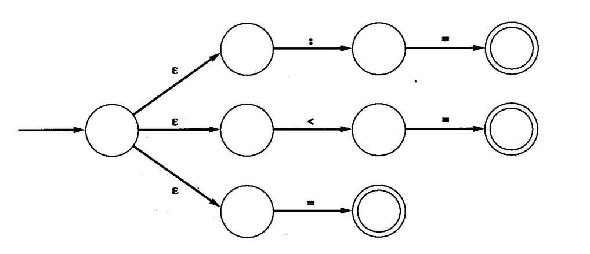

##### NFA定义

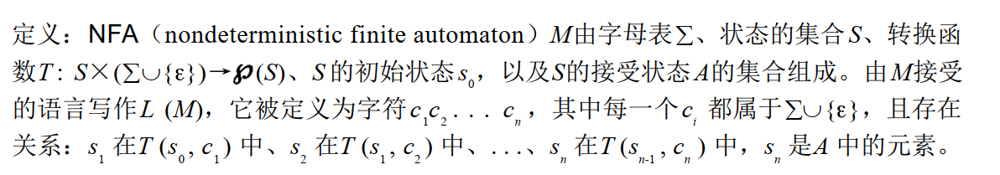

###### 例3：$(a|c)^*b$

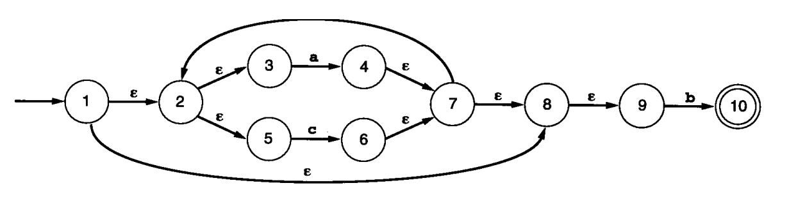

### 2.4 从正则表达式到DFA

##### 从正则表达式到NFA

###### 连接

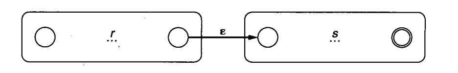

###### 选择

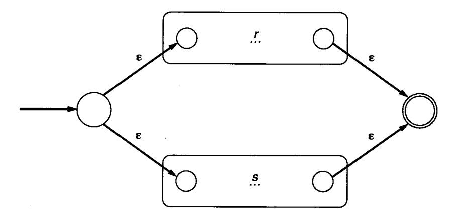

###### 闭包

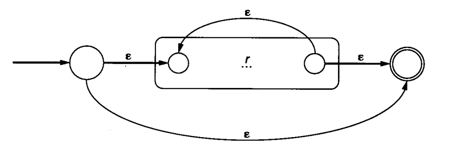

##### 例4：$ab|a$

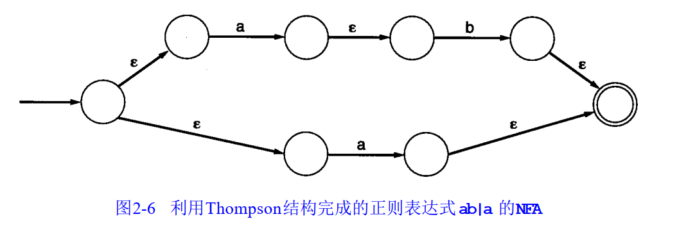

##### 例5：$letter~(letter~|~digit)^*$

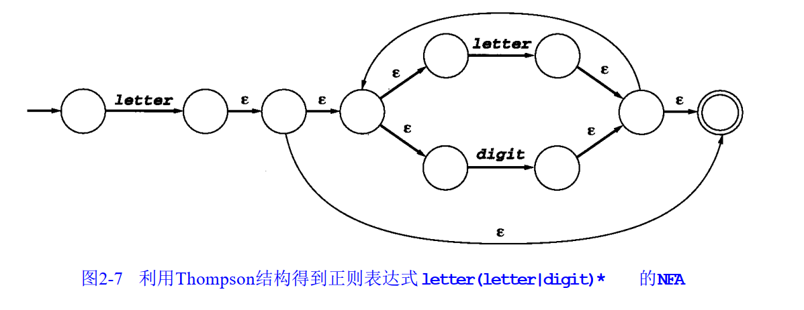

##### 从NFA到DFA

###### ε - 闭包

我们将单个状态$s$的ε - 闭包定义为可由一系列的零个或多个ε - 转换能达到的状态集合，并将这个集合写作 

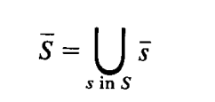

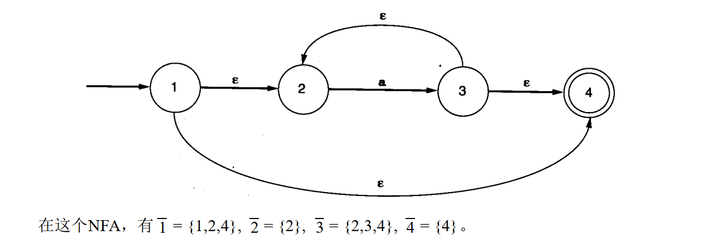

###### 子集构造法，例6：$letter~(letter~|~digit)^*$

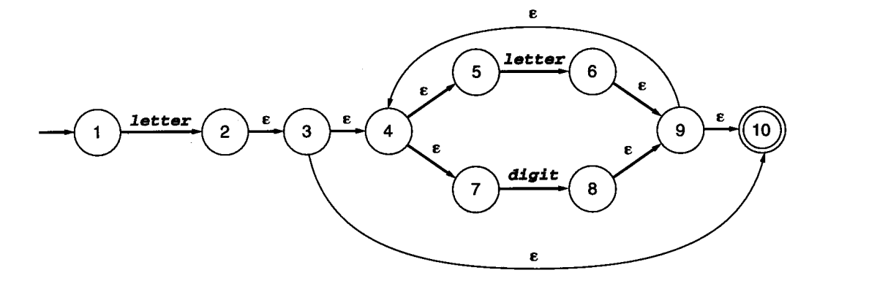

子集构造结果：

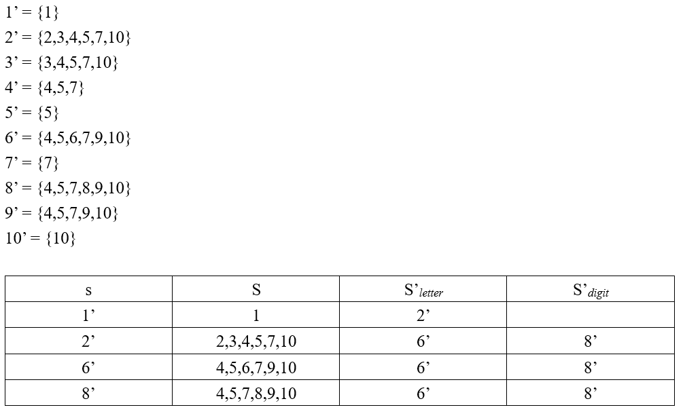

转换后的DFA：

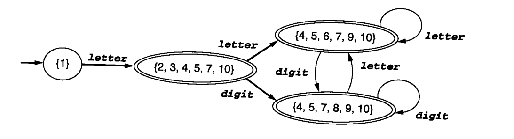

###### 将DFA状态数最小化

**对于任何给定的DFA，都有一个含有最少量状态的等价的DFA，而且这个最小状态的DFA是唯一的**

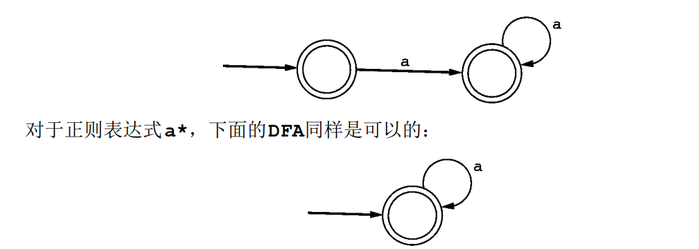

该算法通过**创建统一到单个状态的状态集**来进行。它以最乐观的假设开始：**创建两个集合，其中之一包含了所有的接受状态，而另一个则由所有的非接受状态组成**。假设这样来划分原始DFA的状态， 还要考虑字母表中每个a上的转换。如果所有的接受状态在a上都有到接受状态的转换，那么这样就定义了一个由新接受状态（所有旧接受状态的集合）到其自身的a-转换。另一方面，如果**接受状态s和t在a上有转换且位于不同的集合，则这组状态不能定义任何a-转换，此时就称作a区分了状态s和t**。在这种情况下必须根据考虑中状态集合（即所有接受状态的集合）的a-转换的位置而将它们分隔开。  

###### 例6：标识符的最小化状态数DFA

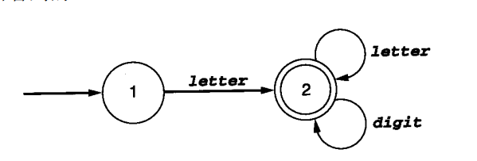

###### 例7：考虑下面的DFA

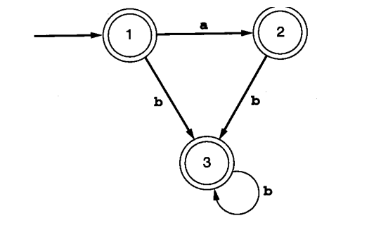


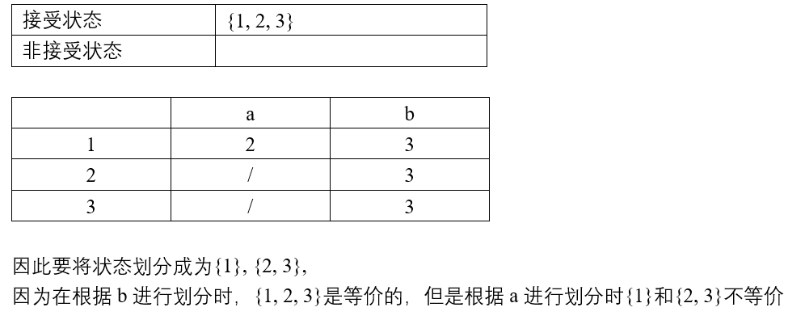

###### 例8：考虑下列DFA

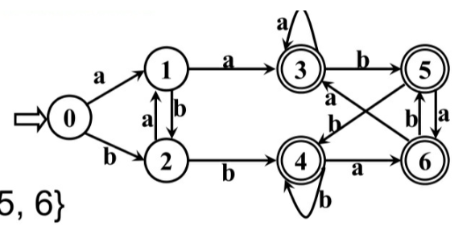

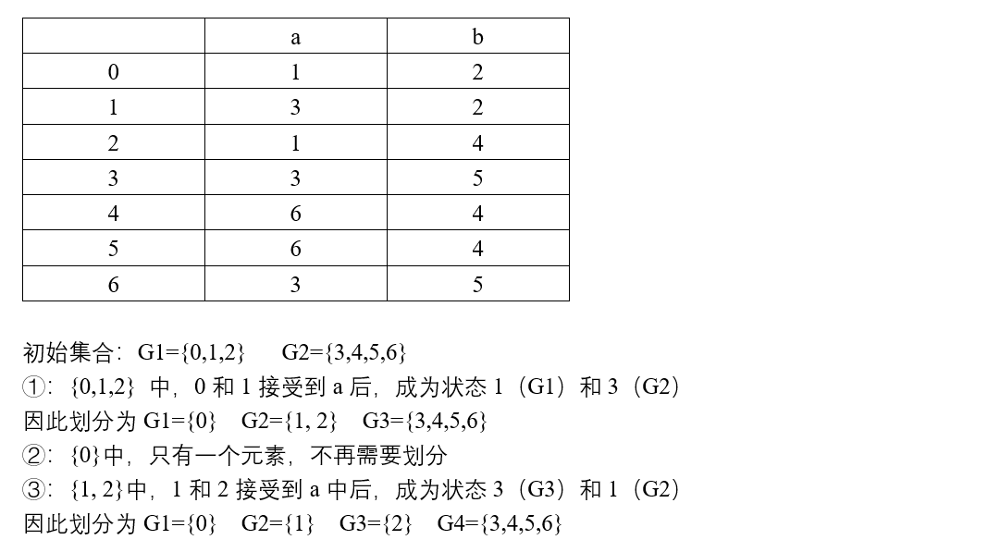

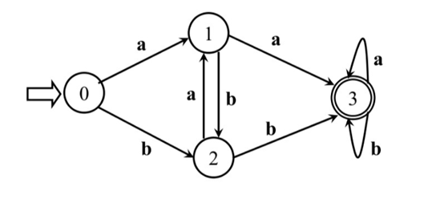

#### 2.6 利用Lex自动生成扫描程序

Lex是一个将包含了正则表达式的文本文件作为其输入的程序，此外还包括每一个表达式被匹配时所采取的动作   

Lex生成一个包含了定义过程yylex的C源代码的输出文件  

##### Lex输入文件的格式

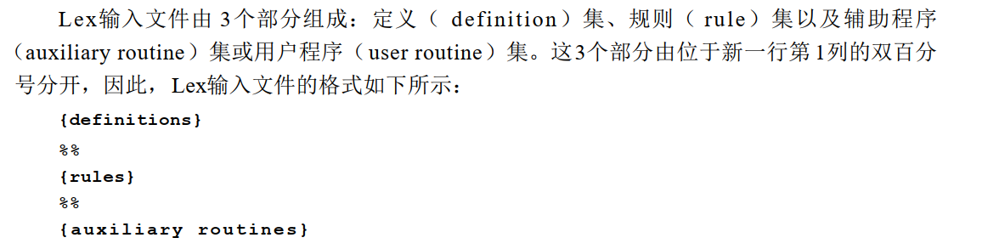

