### Chapter 6 语义分析

##### 静态语义分析需要做的事

- 构造符号表
- 记录声明中建立的名字的含义
- 在表达式和语句中进行类型推断和类型检查
- 在作用域中判断正确性


#### 6.1 属性和属性文法

##### 属性是编程语言结构的任意特性

- 变量的数据类型data type：有静态的也有动态的，比如C或Pascal这种静态类型的语言需要通过类型检查器(type checker)在编译时进行确定；而LISP这样的语言中数据类型是动态的，LISP编译程序必须生成代码来计算类型，并在程序执行期间完成类型检查
  - `+,-,*,/`运算符的操作数必须是整型，且其结果是整型
  - `==, !=`运算符的操作数类型是整型或者字符串，且其结果是布尔型
  - 对于赋值语句`=`，左右两边类型相同
  - 对于方法调用`f(arg1,arg2...)`，每个参数类型必须与声明一致
  - 函数的返回值的类型必须与函数声明时的返回值一致
- 表达式的值value of an expression：通常是动态的，但是有一些表达式常量可以在编译的时候求值
- 变量在内存中的位置信息 location of variable：可以是静态的也可以是动态的，如FORTRAN中所有变量都是静态的，LISP中所有变量都是动态的，C和Pascal是混合的
- 程序的目标代码object code of a procedure：是静态的
- 数的有效位数number of significant digits

##### 属性的连编(*binding*)

- 静态：在执行之前连编的属性
- 动态：只在执行的时候连编的属性

##### 属性文法

假设属性的集合为$a_0,~a_1,~a_2,~...,~a_k$

语法制导的语义原理应用于每个文法规则$X_0~→~X_1X_2...X_n$(这里$X_0$是非终结符号，其它任意)

每个文法符号$X_i$的属性$X_i.a_j$与其它符号的属性值有关，每个关系用**属性等式(attribute equation)和语义规则(semantic rule)**表示出来：

$$X_i.a_j~~=~~f_{ij}~(X_0a_1,...X_0a_k,X_1a_1,...X_1a_k,...,X_na_1,...X_na_k)$$

##### 例1：无符号数文法

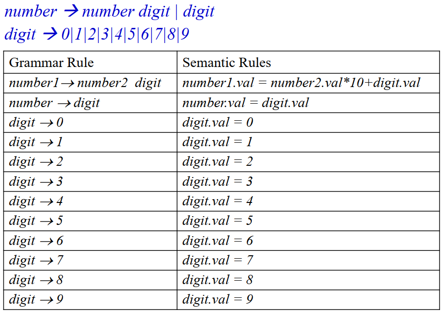

##### 例2：整数表达式运算文法

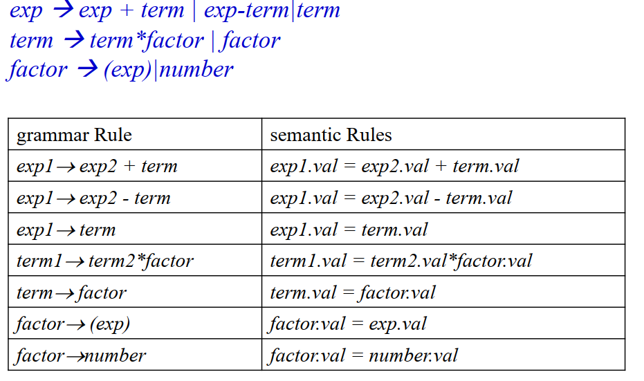

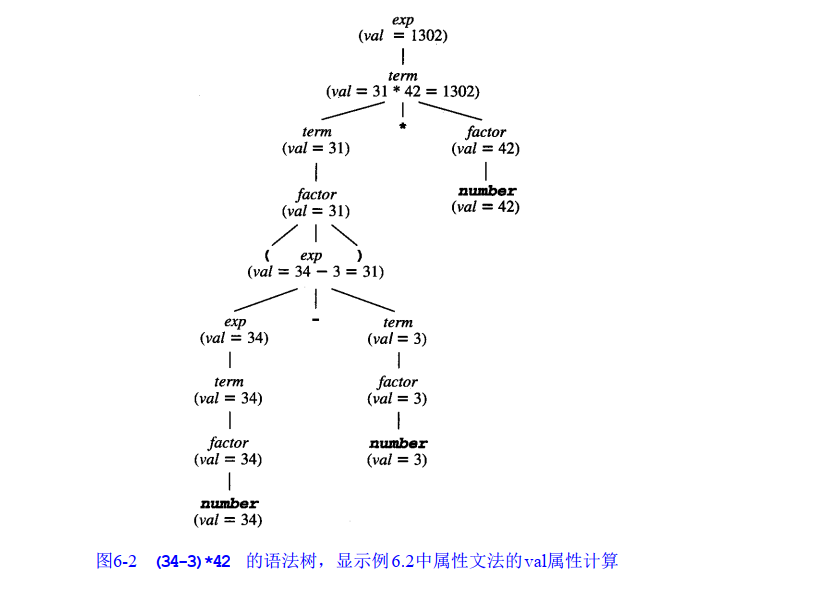

##### 例3：带基数的数值

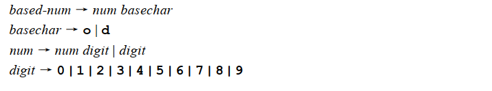

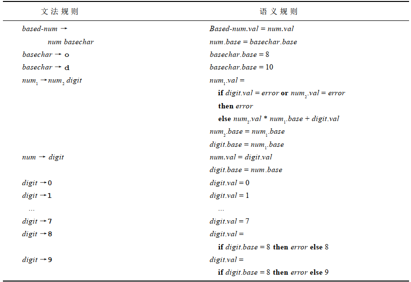


##### 元语言(*metalanguage*)是在属性等式中，允许出现的表达式的集合

- 算术型(arithmetic)、逻辑型(logical)运算符
- `if-then-else`和`switch-case`表达式
- 自定义的函数，如`digit.val = numval(D)`


#### 6.2 属性计算算法

##### 相关依赖图(*associated dependency graph*)

假设有属性等式：$number_1.val=number_2.val*10+digit.val$

则对应的依赖图是：

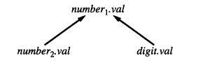

##### 属性计算的方法

- 属性的相关依赖图是DAG
- 使用拓扑排序判断计算的优先级

##### 合成属性(*synthesized attribute*)

一个属性是合成的，当且仅当在语法树中它所有的相关都从子节点指向父节点。

如果一个属性文法中所有的属性都是合成的，就称作**S-属性文法(*S-attributed Grammar*)**

S属性文法的属性值可以通过对树进行后序遍历来计算

```pascal
procedure PostEval(T: treeNode);
begin
	for each child C of T do
		PostEval(C);
	compute all synthesized attributes of T;
end;
```

##### 继承属性(*inherited attribute*)

如果一个属性不是合成的，那它就是继承属性

继承属性的计算可以通过前序遍历或前序/中序遍历的组合来进行

```pascal
procedure PreEval(T:treenode);
begin
	for each child C of T do
		compute all inherited attributes of C;
	PreEval(C);
end;
```

##### 使用函数的参数和返回值计算属性

- 把继承属性作为参数传入
- 把综合属性作为返回值输出

##### 使用外部数据结构存储属性值

- 通过符号表存储
- 基本的数据结构有`insert`、`lookup`和`delete`

##### L-属性文法

如果对于每个**继承属性**$a_j$和每个文法规则$X_0→X_1X_2...X_n$都有以下等式：

$X_i.a_j=f_{ij}(X_0.a_1,...X_0.a_k,X_1.a_1,...X_1.a_k,...,X_{i-1}.a_1,...X_{i-1}.a_k)$

作为一个特例，**S-属性文法就是一种L-属性文法**

- 因为S-属性文法中没有继承属性，自然L属性文法的条件成立


##### LR分析中合成属性的计算

- LR分析程序中通常由一个值栈存储合成属性(如果对每个文法符号有不止一个属性，可能是联合或结构)。值
  栈将和分析栈并行操作，根据属性等式每次在分析栈出现移进或规约来计算新值。  

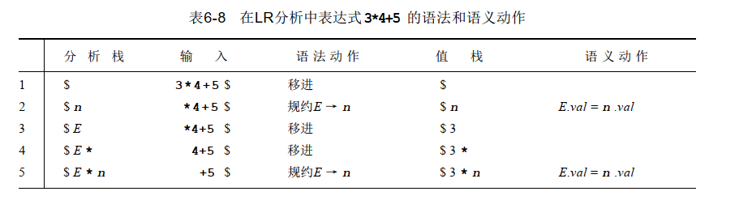

##### LR分析中继承属性的计算

因为LR分析使用从左向右的赋值策略，因为这些值已经被压进了值栈，所以与规则右边非终止符相关的动作可以把符号的合成属性使用到规则的左边。  

假设$A→BC$，$C.i=f(B.s)$，即计算C的继承属性$i$需要用到B的综合属性$s$

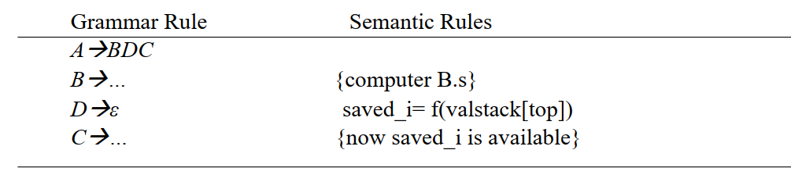

##### 通过文法改造可以使继承属性变成综合属性

改造前

```
decl → type var-list
varlist → id, var-list | id
type → int | float
```

改造后

```
decl → varlist id
var-list → varlist id , | type
type → int | float
```

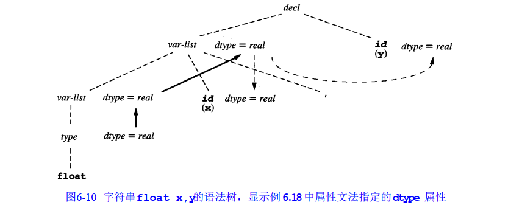


#### 6.3 符号表

符号表的实现：HashMap + LinkedList

每一个Entry的结构包括：

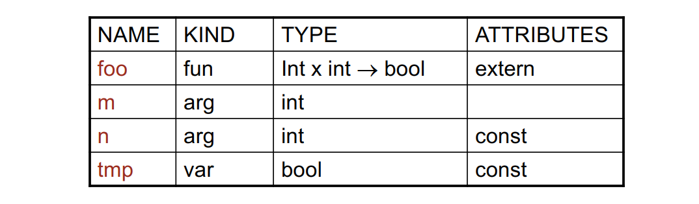

##### 编程语言中的声明(declaration)

- 常量声明
  - `const int size = 199`
  - `#define`：预处理阶段，不是严格意义上的编译器处理阶段
- 变量声明
  - `int a, b[100]`
- 类型声明
  - `struct Entry { ... }`
  - `union`
- 过程/函数声明

##### 符号表使用策略

- 使一张符号表存储所有的声明：当语言禁止在不同种类的声明时使用相同的名字比较适用
- 对每种声明使用不同的符号表：如所有的类型声明在一张符号表里，所有的变量声明在另一张符号表里
- 在程序的不同区域有独立的符号表，并按照语言的语义规则链接在一起

##### 符号表作用域处理示意图

```C
int i, j ;
int f(int size)
{ 
    char i, temp;
	…
	{
        double j;
		…
	}
    {
		char * j;
		…
    }
}
```

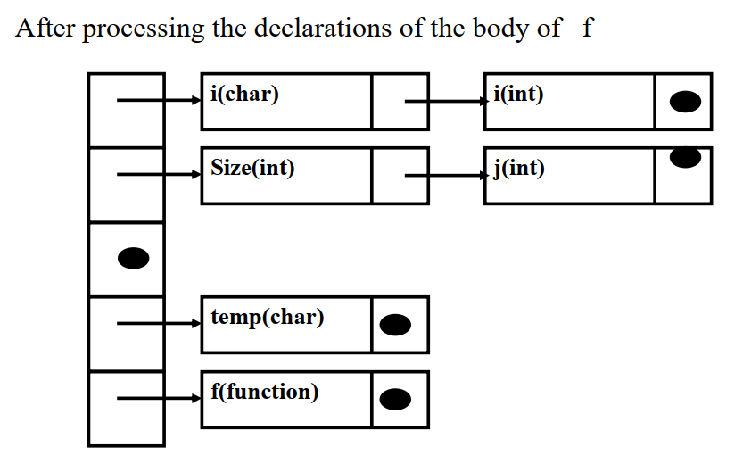

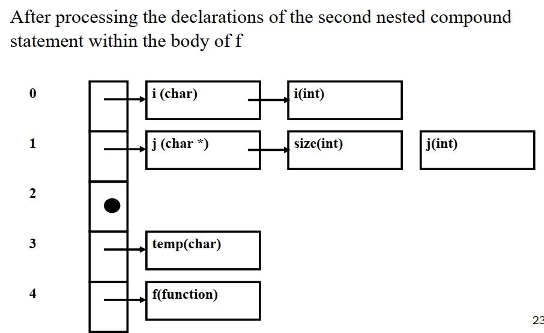

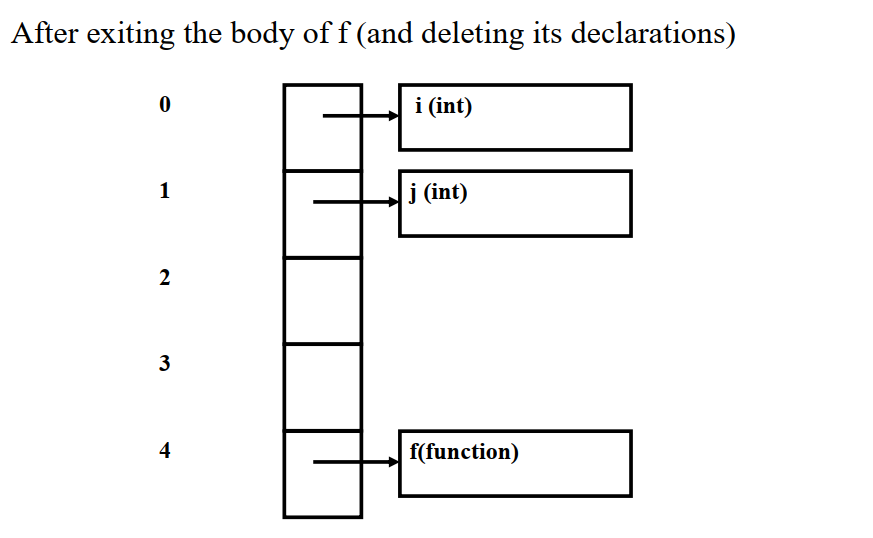

##### 同层说明的相互作用

考虑下面的C代码

```C
int i = 1;
void f (void)
{ 
    int i = 2, j = i + 1;
}
```

根据最近嵌套规则，应该是使用最近的说明——局部说明

这也预示着在处理时，把每个说明加入符号表，这也称为**顺序声明(*sequential declaration*)**

**并列声明(*collateral declaration*)：**替代所有要"同时"处理的声明，在说明部分的最后立即加进符号表，然后说明中任意表达式的名字将引用前面的说明，不再处理新的说明。一些函数式语言如ML和Scheme有这样的说明结构。这样的说明规则要求说明不立即加进存在的符号表中，而是累加进一个新的表中，在处理完所有的说明后再加入现存的表中。

**递归声明(*recursive declaration*)**：声明可以引用其自身或者相互引用。这对于过程/函数特别重要，相互递归的函数组是公共的。

```C
void f (void)
{... g () ... }
void g (void)
{... f () ... }
```


#### 6.4 数据类型和类型检查

##### 类型构造器

数组

- 有两个类型参数，索引类型和元素类型
- array [*index type*] of [*component type*]

记录或结构

- 接收一个名字列表和相关的类型并构造一个新的类型
- 不同类型的元素可以组合起来，使用名字而不是索引访问不同的元素

联合

- 为每个元素并行地分配存储器，这样每个元素类型的存储器与所有其他的类型相重叠  

指针

- 由引用另一个类型值的值组成。因此，指针类型的值是一个存储器地址
- 指针类型经常被看成是数字类型，因为在其上可以进行算术运算

函数

- 函数类型按照目标机器的地址的大小分配空间

类

##### 类型说明(*type declaration*)

具有丰富类型构造器的语言通常也给编程者提供一个机制给类型表达式赋名。

```c
typedef struct {
    double r;
    int i;
} RealIntRec;
```

OR

```c
struct {
    double r;
    int i;
} RealIntRec;
typedef struct RealIntRec RealIntRec;
```

##### 类型等价 (*type equivalence*)

给定语言可能的类型表达式，类型检查器经常需要回答何时两个类型表达式表示相同的类型

```
function typeEqual( t1, t2: TypeExp ): Boolean;
```

上述函数接受两个类型表达式，如果根据语言的类型等价规则它们表示相同的类型就返回TRUE，否则返回FALSE。  

一种简单的方法是使用语法树表示，因为这使得从说明的语法直接转换到类型的内部表示十分容易。 

结构等价(structual equivalence)

- 仅有的可用于缺省类型名的等价方式
- 两个类型当且仅当它们有相同的结构时它们才相同
- 如果用语法树表示类型，当且仅当它们的语法树结构是同一的
- 即结构相同，结构名可以不同

名称等价(name equivalence)

- 当且仅当它们是相同的简单类型或有相同的类型名

- 强类型等价

- 例：给定类型说明`t1 = int; t2 = int;`，类型`t1,t2`不等价

- 名称等价中一个复杂的因素是类型表达式不同于简单类型，或类型名在变量说明中继续被使用，或者作为类型表达式的子表达式。在这些情况下，类型表达式可能没有给定明确的名字，编译器将产生一个类型表达式的中间名，与其他任何名字都不同。

  ```
  x: array [10] of int;
  y: array [10] of int;
  ```

  x和y不是名等价的，因为对应于类型表达式`array [10] of int`的变量x和y会被编译器赋予不同的类型名。

声明等价(declaration equivalence)

- 是名称等价的弱化版本
- 类似`t2=t1`这样的声明是作为类型别名解释的，而不是新的类型(作为名等价中)
- 因此`t1 = int; t2 = int; t2=t1;`这种情况下类型`t1,t2`等价
- 为实现说明等价，符号表必须提供一个新的操作`getBaseTypeName`，它取出**基类型名**而不是相关的类型表达式。在符号表中，一个类型名如果是预说明类型或由类型表达式给出，而不只是另一个类型名，它就被区分为基类型名。注意，说明等价类似于名等价，在检查递归类型时解决无限循环问题，因为如果两个基类型名有相同的名字只能是说明等价。  

PASCAL一律使用声明等价，C对结构和联合使用声明等价，但对指针和数组使用结构等价。  