### Chapter 7 运行时环境

##### 定义

运行时环境**(*runtime environment*)**指的是目标计算机的寄存器以及存储器的结构，用来管理存储器并保存指导执行过程所需的信息 。

##### 环境的类型

- 完全静态环境：FORTRAN77
- 基于栈的环境：C/C++，Pascal
- 完全动态环境：LISP


#### 7.1 程序运行时的存储器组织

##### 典型的计算机存储器

- 寄存器区域
- 直接编址的随机访问存储器RAM

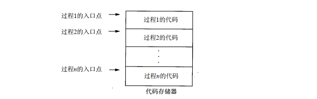

##### 运行时的存储器组织

- 在组织全局/静态区域中出现的一个问题是它涉及到编译时所知的常量。诸如0和1这样较小的编译时常量通常由编译程序直接插入到代码中且不为其分配任何数据空间。同样地，由于编译程序已掌握了全局函数或过程的入口点且可直接将其插入到代码中，所以也不为它们分配全局数据区。
- 然而我们却将大型的整型值、浮点值，特别是串文字分配到全局 /静态区域中的存储器，在启动时仅保存一次，之后再由执行代码从这些位置中得到 。


##### 单元活动记录(*procedure activation record*)

当调用或激活过程或函数时，它包含了为其局部数据分配的存储器。 

分配的顺序（同压栈顺序）如下：

- 参数
- 返回地址
- 局部变量
- 局部临时变量

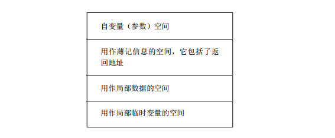

根据语言的不同，可能将活动记录分配在静态区域(FORTRAN77)、栈区域(C/C++，Pascal)、或堆区域(LISP)。

当将活动记录保存在栈中时，它们有时指的是栈框架(stack frame)。  

当处理器具有多个寄存器时，正如在较新的RISC处理器中一样，整个静态区域和整个活动记录都可完整地保存在寄存器中。  


#### 7.2 完全静态的运行时环境

##### 特点

- 所有数据都是静态的，且执行程序期间在存储器中保持固定。 
- 没有指针或动态分配，且过程不可递归调用。  
- 每个过程只有一个在执行之前被静态分配的活动记录。
- 通过固定的地址直接访问所有的变量，而不论它们是局部的还是全局的 。
- 保留每个活动记录的簿记信息开销相对较小，而且也不需要在活动记录中保存有关环境的额外信息 (而不是返回地址)。

##### 程序存储器结构

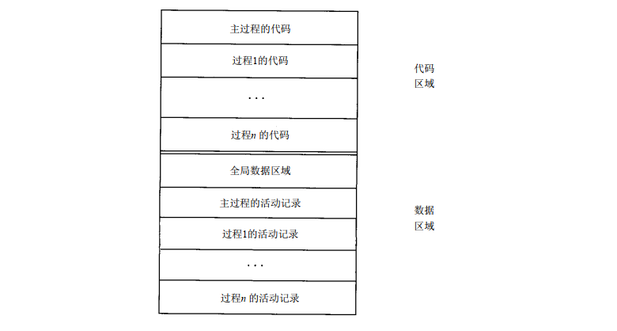

##### 调用过程时的操作

- **计算每个自变量**，并将其保存到被调用过程的活动中恰当的参数位置。  
- **保存调用程序代码中的返回地址**，并转移到被调用的过程的代码开头。
- 返回时，**转移到返回地址**。

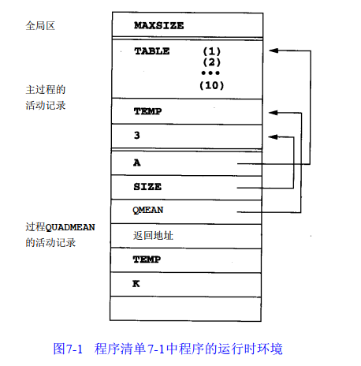

PS：图7-1中还有一个特性需要解释一下，  最后一个空白处是活动记录分配的未命名地址，用于存储临时变量值的凑合的地址。因为在这个函数中计算TEMP+A(K)*A(K)以及SQRT(TEMP/SIZE)都需要一个空间来存储运算值的中间结果。


#### 7.3 基于堆栈的运行时环境

##### 特点

- **允许递归**调用
- 局部变量都是**新分配**的
- 活动记录都是以栈的风格**动态分配**的（不能被静态分配），每个函数调用可能在栈中**同时存在多个活动记录**

##### 框架指针(frame pointer, FP)

指向当前活动的指针称为FP，通常保存在FP寄存器中。

在当前活动记录中，FP指向的是**当前活动记录的控制链**。

##### 控制链(control link)或动态链(dynamic link)

作为一个指向先前活动记录的指针，有关先前活动的信息一般是放在当前活动中，并被认为是控制链，有时将这个指针称为old FP，因为它代表了FP的先前值。

##### 栈指针(stack pointer, sp)

通常指向调用栈上的最后位置(称为栈顶指针，tos)

##### 例1：GCD函数

```C++
int gcd(int u, int v) {
    if (v == 0) return u;
    else return gcd(v, u % v);
}

main() {
    int x = 15;
    int y = 10;
    gcd(x, y);
}
```

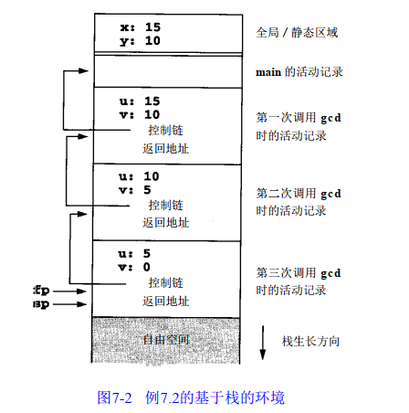

控制链和返回地址的区别

- 控制链指向的是上一个**活动记录**的FP，当函数返回时，FP会被替换成Old FP
- 函数的返回地址指的是，返回时应该执行**代码段**中哪一条指令

##### 例2：嵌套递归调用

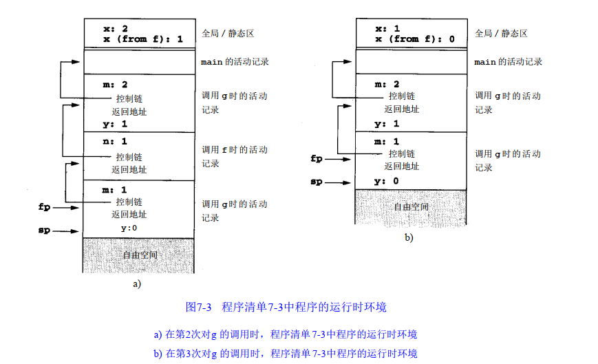

##### 活动树(activation tree)

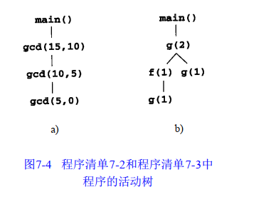

##### 对名称的访问 

在基于栈的环境中，再也不能像在完全静态环境中那样用固定的地址访问参数和局部变量。而它们由**当前框架指针的偏移量**发现。  

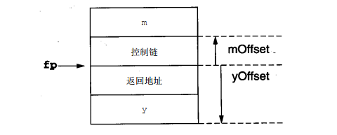

PS：y向m方向地址逐渐增高

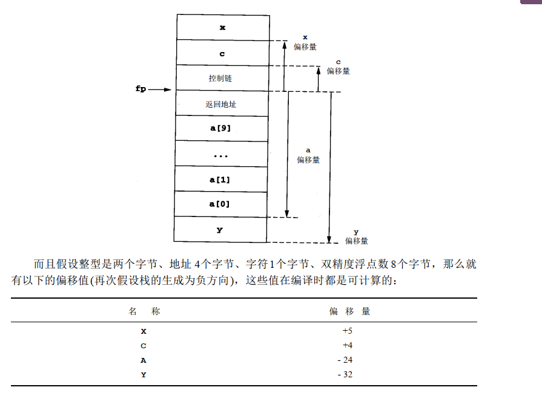

##### 调用过程

- 计算自变量，并存放到新活动记录的正确位置
- 将FP作为控制链存放到新的活动记录中
  - Push FP
- 改变FP使其指向新的活动记录的开始：即当存在SP时，将SP复制到FP上
  - Mov FP, SP
- 将返回地址存放的新的活动记录中
- 代码跳转


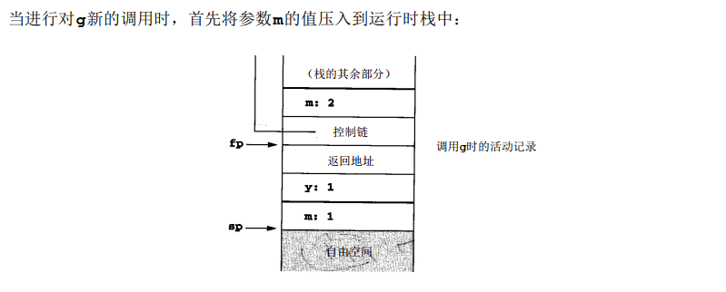

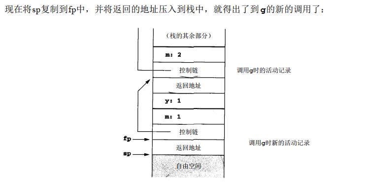

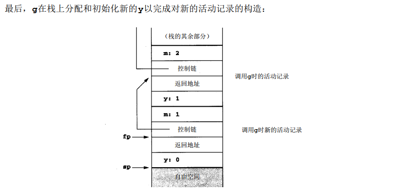

##### 返回过程

- 向上移过局部变量，使得SP = FP（此处指地址），其实就是Mov SP, FP
- 将控制链装载到FP中
- 完成返回地址的转移
- 调整SP指针（向上），把参数扔掉

##### 处理可变长度数据

C编译程序一般通过把调用的自变量按相反顺序压入到运行时栈来处理。

这使得被调用函数能够使用帧指针加一个偏移量来访问参数。

##### 局部临时变量和嵌套声明  

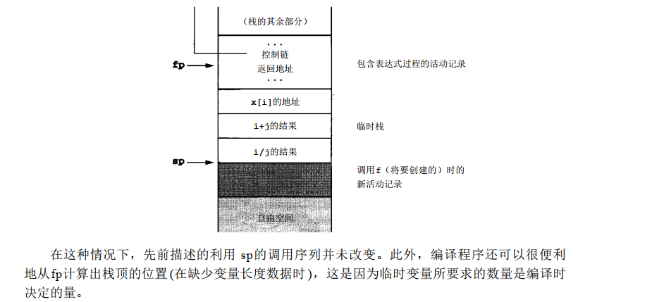

##### 带有局部过程的基于栈的环境

```C
void p(int x, double y) {
    char a;
    int i;
    A: {
        double x;
        int j;
        ...
    }
    B: {
        char *a;
        int k;
        ...
    }
}
```

- 只有进入块时才进行分配
- A和B两块不能共存（同时分配）
- 可以使用处理局部变量的方法去处理它

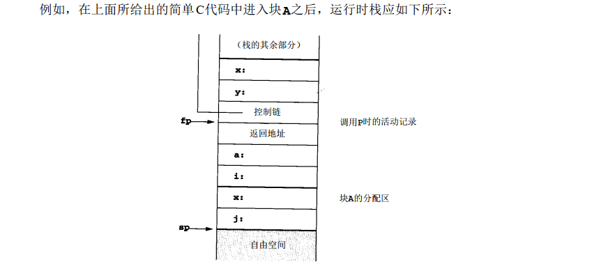

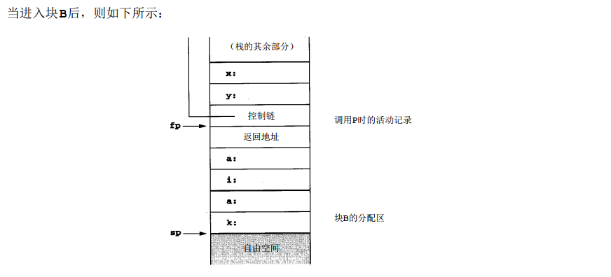

##### 带有局部过程的基于栈的运行时环境

使用访问链**(Access Link)**来实现

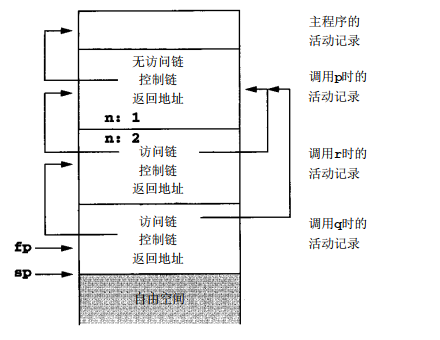

- The access link must be pushed onto the runtime stack just ***before the fp*** during a call
- The ***sp*** must ***be adjusted by an extra amount*** to ***remove the access*** link after an exit.  

计算访问链的方法

- Using the ***(compile-time) nesting level information*** attached to the declaration of the procedure; 
- Generate ***an access chain*** as if to access a variable at the same nesting level.  


#### 7.4 动态存储器

##### 基于栈时的运行环境的缺陷

```C
int* danger(void) {
    int x;
    return &x;
}
```

现在赋值`addr = dangle()`使`addr`指向活动栈中的不安全的地址，它的值可由后面对任何过程的调用随机改变。C对此类问题的处理是，只说明这样的程序是错误的 。

##### 动态运行环境特点

- 当活动记录中所有的引用都消失时，才会回收空间(When control is returned to the caller, the exited activation record remains in memory, to be de-allocated at some later time)

##### OO语言的动态内存分配

- 特点：对象、方法、继承、多态
- 对象实例化的Object，在内存中有一部分是传统的结构体，有一部分是方法
- 实现对象的机制：
  - 初始化代码将所有当前的继承特征(和方法)直接地复制到记录结构中。
    - 缺点：浪费空间
  - 在执行时将类结构的一个完整的描述保存在每个点的存储器中，并由超类指针维护继承性。接着同用于它的实例变量的域一起，每个对象保持一个指向其定义类的指针，通过这个类就可找到所有 (局部和继承的)的方法。
    - 缺点：虽然实例变量具有可预测的偏移量，但是方法却没有。它们必须由带有查询功能的符号表结构中的名字维护
  - 将整个类结构保存在环境中的另一种方法是，计算出每个类的可用方法的代码指针列表，并将其作为一个虚拟函数表(virtual function table)而存放在(静态)存储器。 它的优点在于：可做出安排以使每个方法都有一个可预测的偏移量，而且也就不再需要用一系列表查询遍历类的层次结构。现在每个对象都包括了一个指向相应的虚拟函数表而不是类结构的指针。


##### 堆管理

###### 一个简单的实现：

实现：环形链表来组织空余块**(Free Blocks)**

缺点：难以分辨需要释放的指针是否是有效的。且碎片化会导致难以申请空间，这就会导致合并

###### 一个复杂的实现：

```C
#define NULL 0
#define MEMSIZE 8096 /* change for different sizes */

typedef double align;
typedef union header {
    struct {
        union header *next;
		unsigned usedsize;
		unsigned freesize;
	} s;
	align a;
} header;
static header mem[MEMSIZE];
static header *memptr=NULL;
```

这个代码使用容量MEMSIZE的静态分配数组作为堆，但也可使用操作系统调用分配堆。

我们定义了一个数据类型Header保存每个存储器块的簿记信息，定义了具有Header类型元素的堆数组，这样就可很容易地将簿记信息保存在存储器块中。  

类型Header包含了3块信息：指向列表的下一个块的指针，当前分配空间的长度 (位于存储器之后)，以及任何后面的自由间的长度(若有的话)。因此，列表中的每个块都有格式 ：


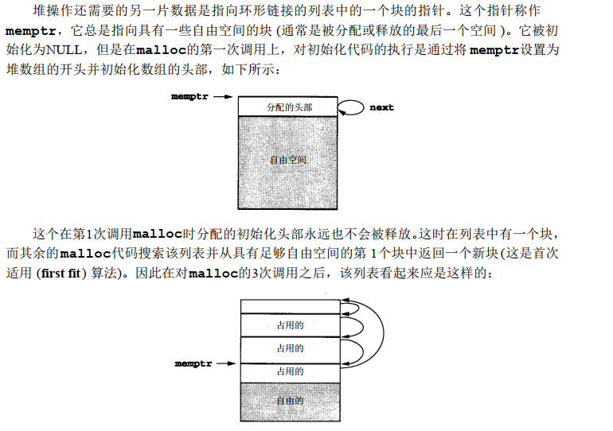

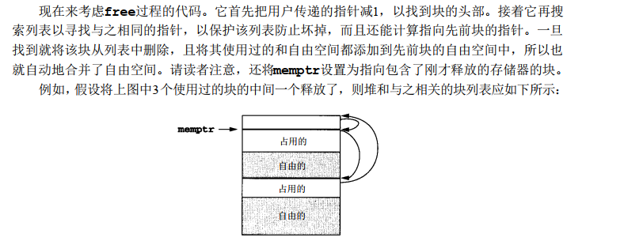

##### 垃圾收集(*Garbage Collection*)

###### 标记-清除算法(Mark And Sweep)

- 寻找可被引用的所有存储器并释放所有未引用的存储器
- 第一遍递归地顺着所有的指针前进，从所有当前的可访问指针值开始，并标出到达的每个存储器块
- 第二遍则线性地打扫存储器，并将未标出的块返回到自由存储器中
- 缺点：要求**额外的存储空间**，在存储器中的两次遍历导致了过程中**很大的延迟**  
- 垃圾回收经常也会通过将所有的分配的空间移到堆的末尾，以及在另一端留下相邻的自由空间的唯一一个大型块而执行**存储器压缩** ***(memory compaction)***

###### 停机和复制 (stop and copy)，二部空间 (two space)回收

PS：停机和复制类似于JVM中的标记-整理算法

- 存储空间分成两半，且每次只使用一半
- 在标记的过程中，将所有可达的块都拷贝到另一半存储空间中
- 不需要标记位
- 自动压缩
- 然而它对存储回收中的过程延迟改进不大  

###### 生育的垃圾回收(generational garbage collection)

- 将生存时间长的对象拷贝到永久代中
- 减少了延迟


#### 7.5 参数传递机制

##### 值传递

- 自变量是在调用时计算的表达式，而且在执行过程时，它们的值就成为了参数的值。
- 这是在C中唯一可用的参数传递机制，且在Pascal和Ada中是缺省的  

##### 引用传递

- 在引用传递中，自变量必须与分配的地址一起变化
- 在FORTRAN77中，引用传递是唯一的参数传递机制的。 
- 在Pascal中使用var关键字传递引用，在C++中使用&传递引用

##### 值的结果传递

- 除了未建立真正的别名之外，这个机制得到的结果与引用传递类似：在过程中复制和使用自变量的值，然后当过程退出时，再将参数的最终值复制回自变量的地址。 
- 双向值传递，Copy in， Copy out，Ada中通过in、out关键字来表示值结果返回

##### 名字传递

- 由于名字传递的思想是直到在被调用的程序真正使用了自变量(作为一个参数)之后才对这个自变量赋值，所以它还称作延迟赋值 (delayed evaluation)。  

##### 例1：

```C
void p(int x, int y) {
    ++x;
    ++y;
}

main() {
    int a = 1;
    p(a, a);
    return 0;
}

// 值传递：a = 1
// 引用传递： a = 3
// 值引用传递：a = 2
	/*
		运行时：
		x = 2
		y = 2
		运行结束时：
		x -> a  =>  a = 2
		y -> a  =>  a = 2
		传递时先给左边传还是给右边传取决于语言特性
	 **/
```

##### 例2：

```C
int i;
int a[10];

void p(int x) {
    ++i;
    //延迟计算时，在这个时候i才会被赋值，等于2
    ++x;
    //延迟计算时，a[2]++;
}

main() {
    i = 1;
    a[1] = 1;
    a[2] = 2;
    p(a[i]);
    return 0;
}

// 值传递：a[1] = 1   a[2] = 2
// 引用传递： a[1] = 2   a[2] = 2
// 值引用传递：a[1] = 2   a[2] = 2
// 名字传递：a[1] = 1  a[2] = 3
```

##### 例3：

```C
#include <stdio.h>
int i=0;
void p(int x, int y)
{
    x += 1;
    i += 1;
    y += 1;
}
main()
{
    int a[2]={1,1};
    p(a[i],a[i]);
    printf(“%d %d\n”,a[0],a[1]);
    return 0;
}
/*
By value:
1, 1
By reference:
3 ,1
By value-result :
2 ,1
By name:
2 ,2
*/
```

ByName的情况：

- 传入函数时i = 0, 并将(a[i], a[i])传入
- 在执行到 x+=1 时，因为i=0，所以(x, y) = (a[0], a[0])，此时a[0]=2
- 在执行到 i+=1 时，因为i=1，所以(x, y) = (a[1], a[1])
- 在执行到 y+=1 时，此时a[1]=2