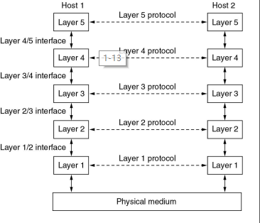
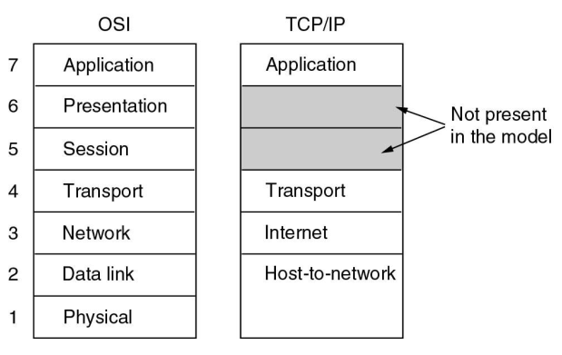
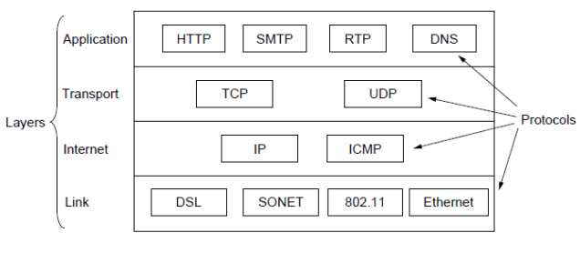

## Chapter 1 Introduction

### 1.3 网络软件

绝大多数网络都组织成一个层次栈(stack of layer)或协议栈(stack of level)，每一层建立在下一层的基础上，每一层的目的是向上一层提供特定的服务，而对实现的细节加以隐蔽。

不同机器上构成相应层次的实体称为对等体(peer)，每一对相邻层次之间的是接口，接口定义了下层向上层提供哪些原语(primitive)操作和服务。

层和协议的集合称为网络体系结构(network architecture)，一个特定的系统使用的一组协议称为协议栈(protocol stack)。

服务原语：

- LISTEN
- CONNECT
- ACCEPT
- RECEIVE
- SEND
- DISCONNECT

### 1.4 参考模型

#### OSI模型

##### OSI模型的核心概念：服务(service)；接口(interface)；协议(protocol)

##### OSI模型在网络层支持无连接和面向连接的通信，但是在传输层只支持面向连接的通信

- 物理层：任务是在一条通信信道上传输比特，要确定用什么电子信号表示1和0，一个比特持续多少纳秒，传输是否可以在两个方向上同时进行，连接如何建立，如何撤销等。
- 数据链路层：发送方将输入数据拆分成数据帧，然后顺序发送这些数据帧。接收方必须确认收到的每一帧，保证数据的顺序和完整性，然后发回确认帧。为了防止发送方淹没慢速接收方，需要对流量进行调节。介质访问控制子层则是控制对共享信道的访问。**不具有拥塞控制功能**
- 网络层：控制子网运行，将数据包从源端路由到接收方；需要处理拥塞；允许异构网络相互连接成互联网络。
- 传输层：接收上一层(会话层)的数据，并将数据分割成较小的单元（分组排序），然后把数据单元传到网络层。**传输层是真正地端到端的层**，始终将源数据从源端带到接收方。1\~3层是链式连接的，而4\~7层是端到端的。
- 会话层：负责管理主机间的会话进程，利用传输层提供的端到端的服务，向表示层提供它的增值服务。服务主要表现为表示层实体或用户进程建立连接并在连接上传输数据，也称建立同步。
- 表示层：关注传递信息的语法和语义。主要是实现数据的格式转换和压缩。
- 应用层：包含了各种各样的协议，提供了用户和网络的接口。

##### 路由器：网络层

##### 交换机：数据链路层

##### 集线器：物理层

#### TCP/IP模型

##### 在网络层仅支持无连接的通信，而在传输层支持无连接和面向连接的通信。

- 链路层
- 互联网层
- 传输层
- 应用层

MPLS协议介于IP层和数据链路层之间。