## Chapter 2 Physical Layer

##### Nyquist Theory: 有限带宽的无噪声信道的最大传输速率

Max Data Rate = $2Blog_2 V$ bps      B为滤波器的(频率)带宽，V为信号的离散等级

**Example:**无噪声的3kHz信道传输二进制信号的最大传输速率为6000bps

##### Shannon Theory: 存在噪声信道的最大传输速率

信噪比(SNR) = $S/N$  写成对数形式为$10log_{10}S/N$，单位是db

Max Data Rate = $Blog_2 (1+S/N)$ bps      

##### 基带信号：将数字信号1和0直接用两种不同的电压表示，然后送到数字信道上传输，称为基带传输。

##### 宽带信号：将基带信号调制后形成频分复用模拟信号，然后送到模拟信道上传输，称为宽带传输。

##### 码元传输速率：单位是波特(Baud)，1波特表示数字通信系统每秒传输1个码元，码元速率与进制数无关，即可以是多进制的也可以是二进制的。若一个码元携带$n$比特的信息，则$M$波特率对应的信息传输速率为$Mn$bps

##### 数字调制(Digital Modulation)：The process of converting between bits and signals that represent them.

### 有线数据传输

- Magnetic media

- Twisted pair（双绞线）

    - consists of ***two insulated copper wires*** typically about 1 mm thick.  

    - can run several kilometers without amplification, but for longer distances, ***repeaters*** are needed. 

        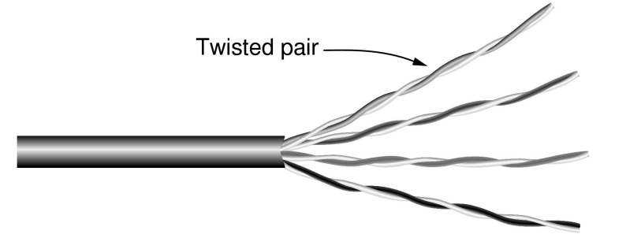

    - Category 5 (100Mbps, 1Gbps)

    - Category 6 (10Gbps)

    - Category 7 (Shielded Twisted Pair) 

- Coaxial cable（同轴电缆）

    - a ***stiff copper wire*** as the core (硬铜线为芯)

    - surrounded by an ***insulating material*** 

    - The insulator is encased by a ***cylindrical conductor***, often as a closely-woven breaded mesh. (绝缘体由圆柱形导体包裹着，通常是密织的网)

    - The outer conductor is covered in a ***protective plastic sheath***. 

    - Two types: 50-ohm (digital), 75-ohm (analog and digital) 

    - Used to be widely used for ***long-distance*** lines. 

        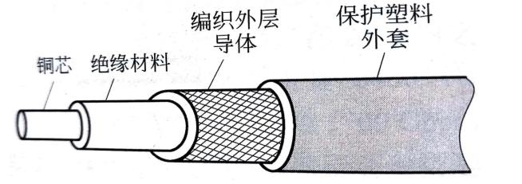

- Power Lines 

- Fiber optics 

    - Multimode (多模): many different rays 

    - Unimode (单模): single rays, ***longer distance*** 

    - Fiber optic cables are similar to coax, except ***without the braid*** 

        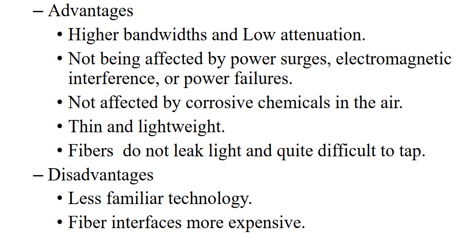

### 基带传输(baseband transmission)

- 归零（RZ）：归零码的特性就是在一个周期内，用二进制传输数据位，在数据位脉冲结束后，需要维持一段时间的低电平。
- 不归零（NRZ）：用高电平表示1，低电平表示0。它与RZ码的区别就是它不用归零，也就是说，一个周期可以全部用来传输数据，这样传输的带宽就可以完全利用。有Nyquist Theory得，NRZ**至少需要B/2 Hz的带宽才能获得B bps的比特率**。
    - Problem: ***a long run of 0s or 1s leaves the signal unchanged***. After a while it is hard to tell the bits apart, as 15 zeros look much like 16 zeros unless you have a very accurate clock. 
- 不归零逆转（NRZI）：信号电平翻转表示1，信号电平不变表示0。
- 曼彻斯特编码（Manchester）：时钟信号与比特异或。**传输每个信号需要2个时钟周期**。
- 二级编码（AMI）
- 4B/5B编码：每4位一组，按照编码法则转换成5位码，共32组合，其余16种作为控制码。

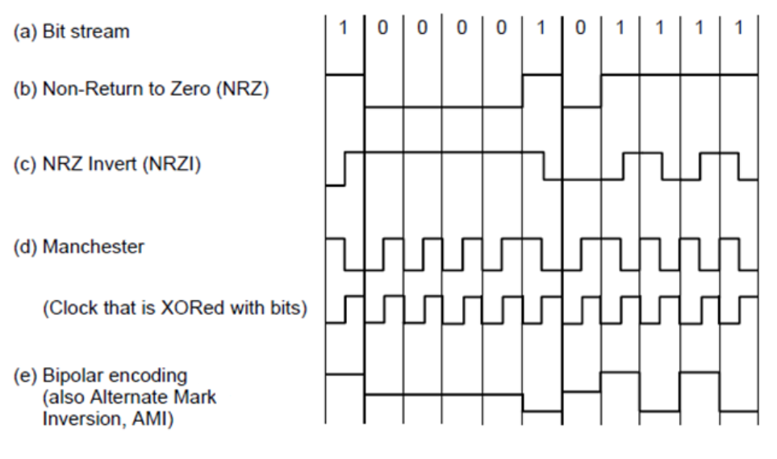

### 通带传输(passband transmission)

幅移键控(ASK, Amplitude Shift Keying)：通过两个或多个振幅表示码元

频移键控(FSK)：通过两个或多个频率表示码元

相移键控(PSK)：通过两个或多个相位表示码元

- 正交相移键控(Quadrature Phase Shift Keying, QPSK)：使用45°，135°，225°，315°四个偏移

星座图(Constellation diagrams)：

对于此类编码方式，比特率$R=Blog_2(mn)$，其中B是波特率

### 频分复用(FDM, Frequency Division Multiplexing)

利用通带传输的优势使多个用户共享信道，每个用户拥有一个频段来发送自己的信号。

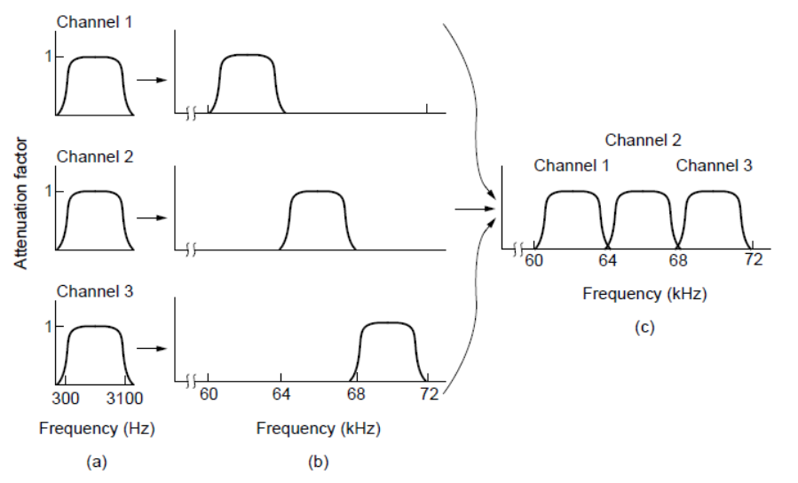

##### OFDM

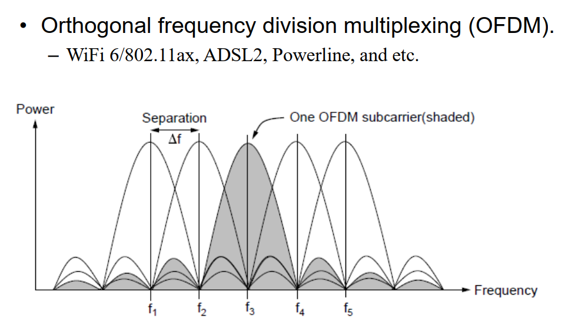

### 时分复用(TDM, Time Division Multiplexing)

每个用户周期性地获得整个带宽非常短的一个时间。每个输入流的比特从一个固定的时间槽取出并输出到混合流。TDM被广泛地应用到电话网络和蜂窝网络。

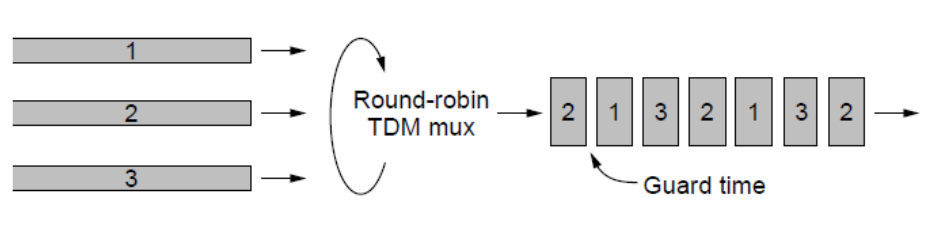

### 码分复用(CDM, Code Division Multiplexing)

##### 码分多址(CDMA)：在CDMA中，每个比特时间被分为m个更短的时间间隔，称为码片(chip)

若要发送比特1，则站就发送分配给它的码片序列，若要发送比特0，就发送其码片序列的反码。

发送站的任何两个码片序列两两正交，归一化内积为0。

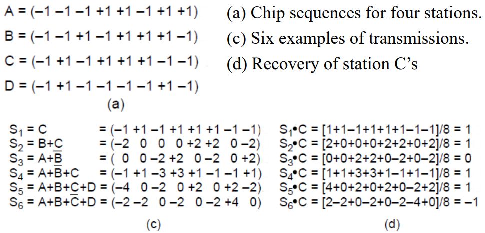

### PSTN(Public Switched Telephone System)

The PSTN is suitable for ***transmitting the human voice*** in a more or less recognizable form.

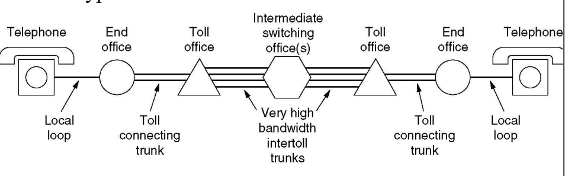

##### Major Components of the Telephone System:

- ***Local loops*** (本地回路): ***Analog twisted pairs*** going to ***houses and businesses*** (not open-loop).
- ***Trunks*** (干线): ***Digital fiber optics*** connecting the switching offices (used to be coaxial cables).
- ***Switching offices*** (交换局): to ***switch calls from one trunk to another*** (manual operators + jumpers → automatic switching computer) 

The ***analog signals are digitized*** in the end office by a device called a ***codec (coder-decoder)***. 

- The codec makes ***8000 samples per second*** (125usec/sample) 
- Each sample of the ***amplitude of the signal*** is quantized to an 8-bit number.
- This technique is called PCM (***Pulse Code Modulation***, 脉冲编码调制). 
- PCM forms the heart of the modern telephone system. As a consequence, virtually all time intervals within the telephone systems are multiples of ***125usec***.  125微秒传输一个193位的帧

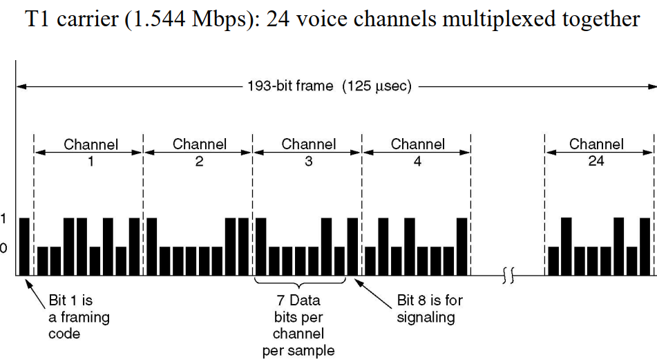

***An T1 channel contains 24 PCM signals, its data rate is 1.544Mbps***

***An E1 channel contains 32 PCM signals, its data rate is 2.048Mbps***

##### Circuit switching：

- 数据直达，通信时延小
- 有序传输
- 不同通信双方拥有不同，没有冲突
- 实时性强，控制简单
- 但是连接建立时间长，线路独占使用效率低，灵活性差，难以规格化

##### Packet switching：

- 无需建立连接
- 动态分配线路
- 线路可靠性高
- 线路利用率高
- 但是会有转发时延

​	

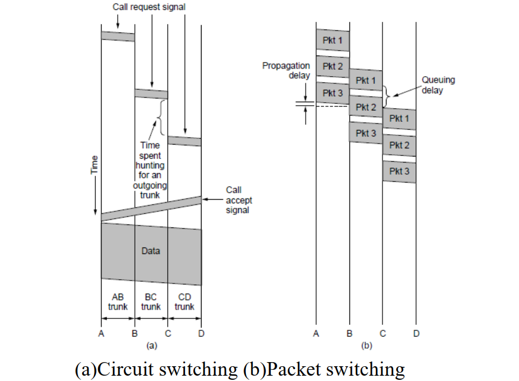