## Chapter 3 Data Link Layer

##### 设计模式

- 向上提供网络层的服务
- 处理传输错误(Error Control)
- 调节数据流，确保慢速接收方不会被快速发送方淹没(Flow Control)

##### 数据包和帧：

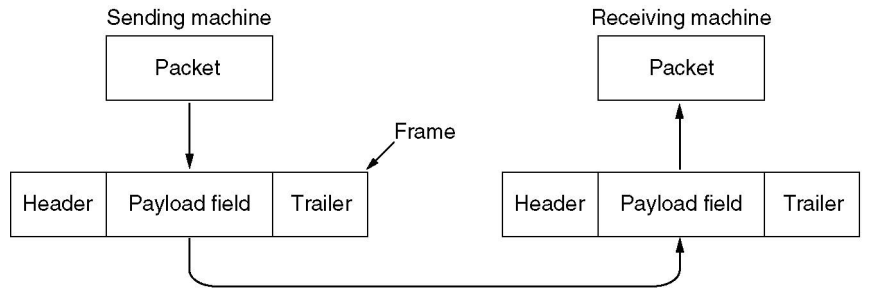

##### 数据链路层提供的服务：

- Unacknowledged connectionless service：无确认无连接，对丢失的帧不负责重发而是交给上层处理，适用于实时通信等或误码率低的信道，如以太网。
- Acknowledged connectionless service：有确认无连接，如无线通信。
- Acknowledged connection-oriented service ：有确认有连接，帧的传输需要建立数据链路、传输帧、释放数据链路。适用于长距离不可靠链路如卫星通信或者长途电话链路。

### 成帧 Framing

##### 字节计数法Byte Count

- 如果计数字段出错将导致失去同步

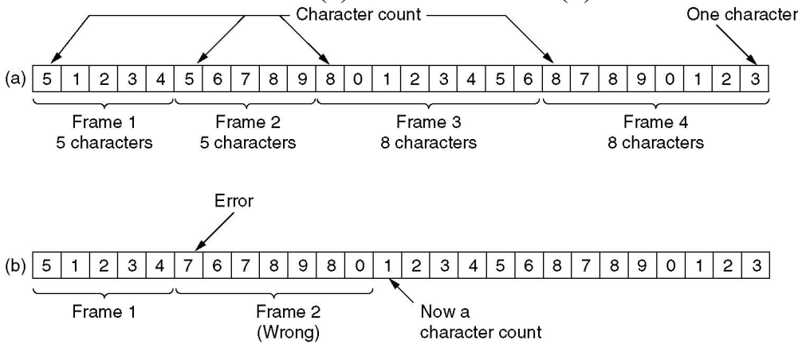

##### 字节填充的标志字节法Flag Bytes With Byte Stuffing 

- 每个帧用标志字节FLAG作为开始和结束
- 使用转义字节ESC转义FLAG和ESC
- 下图显示的是***PPP(Point-to-Point Protocol)***协议的字节填充方案

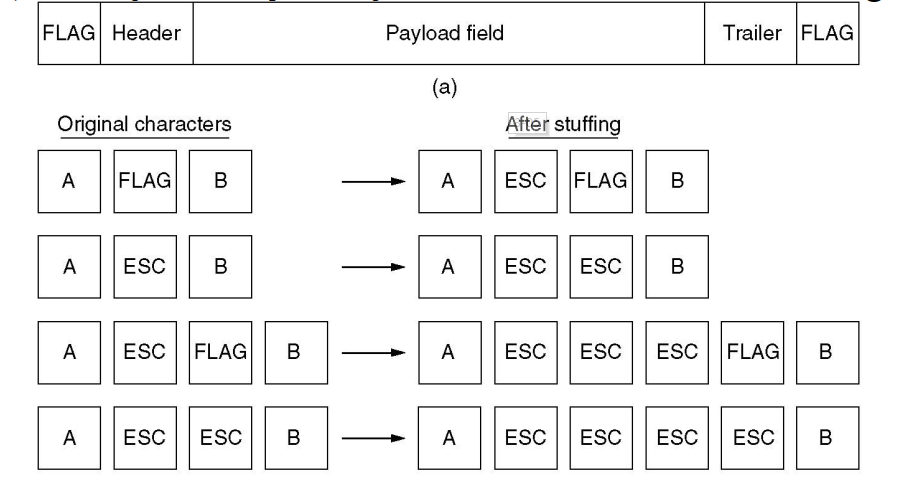

##### 比特填充的标志比特法Flag Bits With Bit Stuffing

- 每个帧的开始和结束由**01111110**标记
- 连续遇到5个1的时候就在输出的比特流中自动填充一个0，这样确保正文不会出现连续的6个1，也就是不会与FLAG产生相同的标记
- 接收方在接收时，每当接收到5个连续的1，就自动删除后面紧跟的0

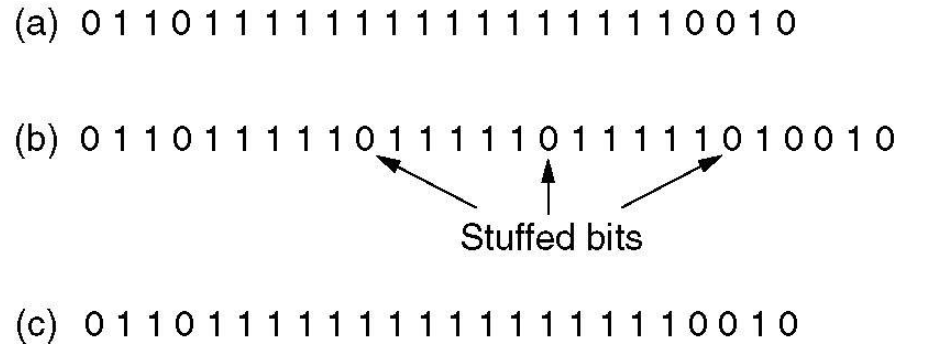

##### 物理层编码违禁法Physical Layer Coding Violations 

- 只适合采取冗余编码的特殊编码环境
- 通过保留信号来指示开始和结束

### 纠错码 Error-Correcting Code

假设一帧由 $m$ 个数据位和 $r$ 个冗余位组成，记 $n=m+r$， 并将该编码描述成$(m,n)$码

##### 海明距离(Hamming Distance): 两个码字(codeword)中不同的位的个数，如果两个码字的汉明距离为 $d$ ，则需要 $d$ 个1位错误才能把一个码字转换成另一个码字。

为了可靠地检测 $d$ 个错误，需要一个海明距离为 $d+1$ 的编码方案。

- 换而言之，海明距离为为 $d$ 的编码方案，最多只能可靠地检测 $d-1$个错误

为了纠正 $d$ 个错误，需要一个海明距离为 $2d+1$ 的编码方案。 

##### 纠正单个错误所需要的校验位数下限：

对于每$2^m$个合法消息，任何一个消息都有$n$个非法码字（即距离为1的非法码字有$n$个），因此每个合法消息都需要用$n+1$个位模式来标识它，由于总共只有$2^n$个位模式，有：$(n+1)2^m≤2^n$

即$(m+r+1)≤2^r$

##### 海明编码：海明距离为3，能够发现双比特错，但是只能纠正单比特错

将码字内的位从左到右依次编号$1..n$ 其中满足2的幂的位为校验码，其余为数据码

以消息$ 010100111111$(反向)的编码为例**（好像有点问题，编号反了）**：

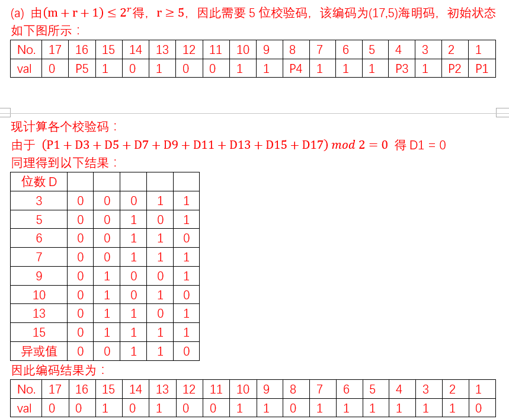 

##### 海明编码纠错：

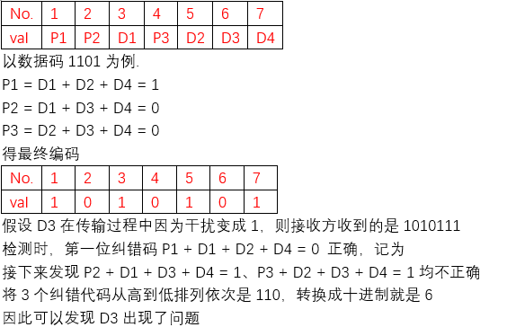

##### 其他纠错码：

- Binary Convolutional Codes 
- Reed-Solomon Codes 
- Low-Density Parity Check Codes (LDPC) 

### 检错码 Error-Detecting Code

#### 奇偶校验码(Parity):

- 可以检验出奇数个比特错误
- 海明距离为2
- 奇校验码，若传输后1的个数是偶数个则能检测出错误，若是奇数个则不能检测出错误

#### CRC码：

- 发送方和接收方约定一个生成多项式$G(x)$，最高位和最低位系数都为1
- 在帧的尾部附加一个校验和，如果附加之后的帧对应的多项式能被$G(x)$除尽，则没有错误，如果有余数，则表明传输的过程中出现错误
- CRC码可以检测出所有的单比特错误
- 带$r$个校验位的多项式编码可以检测到所有长度小于等于$r$的突发性错误

采用生成多项式$G(x)=x^4+x+1$计算帧110101111校验和的例子

- 要点1：假设$G(x)$的阶为$r$，则需要在被除数(数据段)后面加上$r$个0
- 要点2：减法操作为XOR操作，即不借位
- 要点3：除法后得到的余数即为冗余码
- 要点4：最后发出的帧即为原序列跟上$r$个0再加上余数，下面例子发送的数据就是：$11010110111110$
- 要点5：接收方接收到信息后只需使用$G(x)$来除信息即可验证

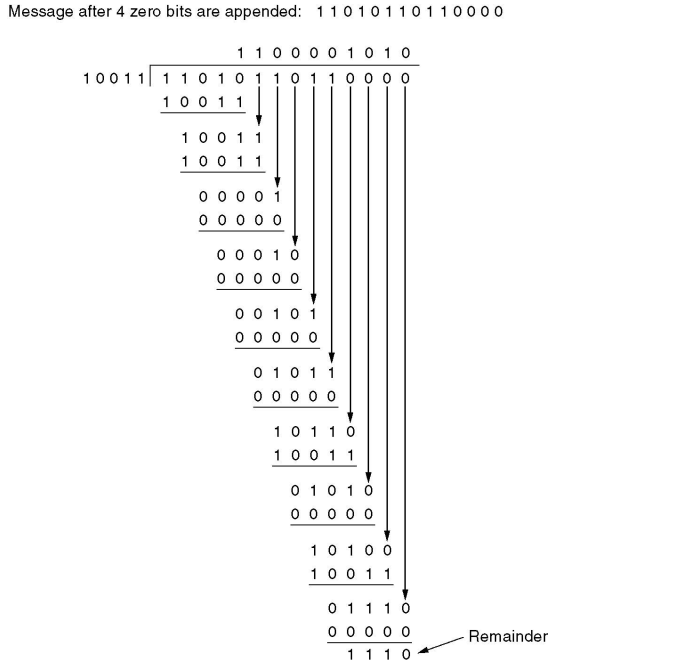

##### 常见的CRC

- CRC-12
- CRC-16
- CRC-32
- CRC-ITU

### 基本数据链路协议

##### ARQ：Automic Reapeat Request

#### Stop-and-Wait Protocol (Protocol2 & Protocol 3)

- 发送方每发送一帧，都要等待接收方的应答信号，之后才能发送下一帧

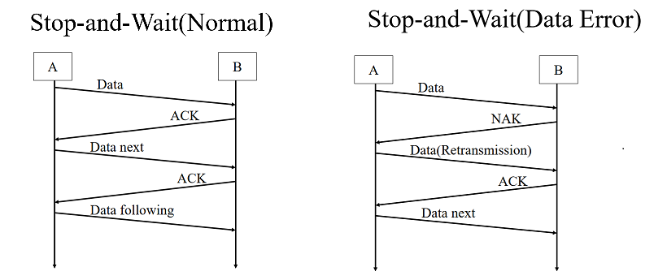

#### Sliding Window Protocol

- 在任何时刻，发送方都维持一组连续的允许发送帧的窗口，称为发送窗口，同时接收方维护一组连续的允许接收帧的窗口，称为接收窗口。

- 发送方每收到一个确认帧，发送窗口就向前移动一个帧的位置。
- 接收端收到数据帧后，将窗口向前移动一个位置，并发回确认帧，若数据帧落在接收窗口之外则一律丢弃。

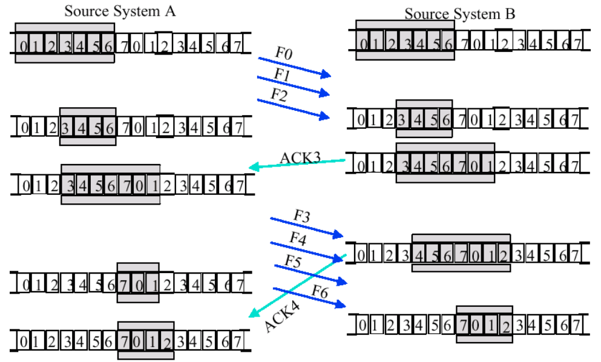

#### Go Back N Protocol

链路利用率$P≤(w)/(1+2BD)$

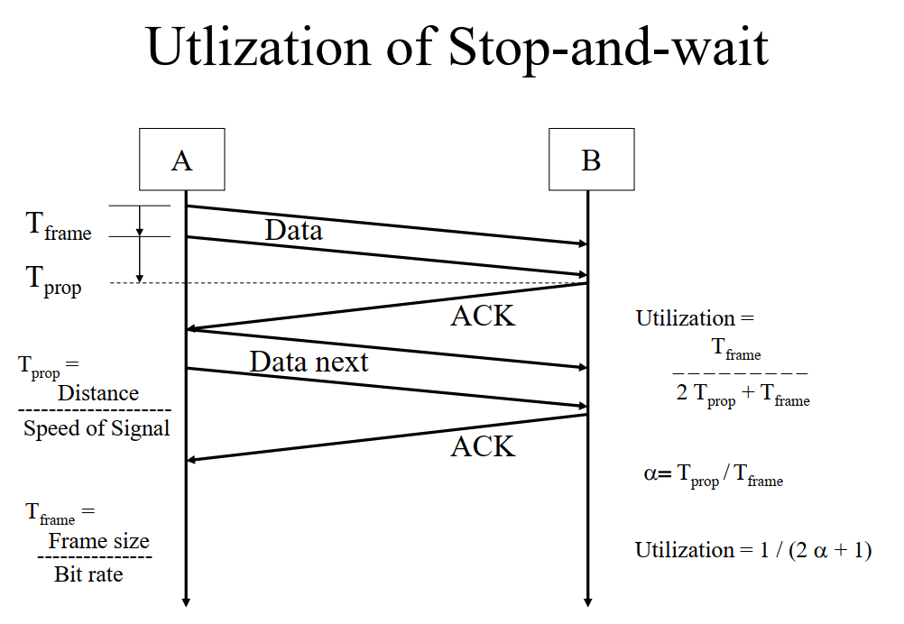

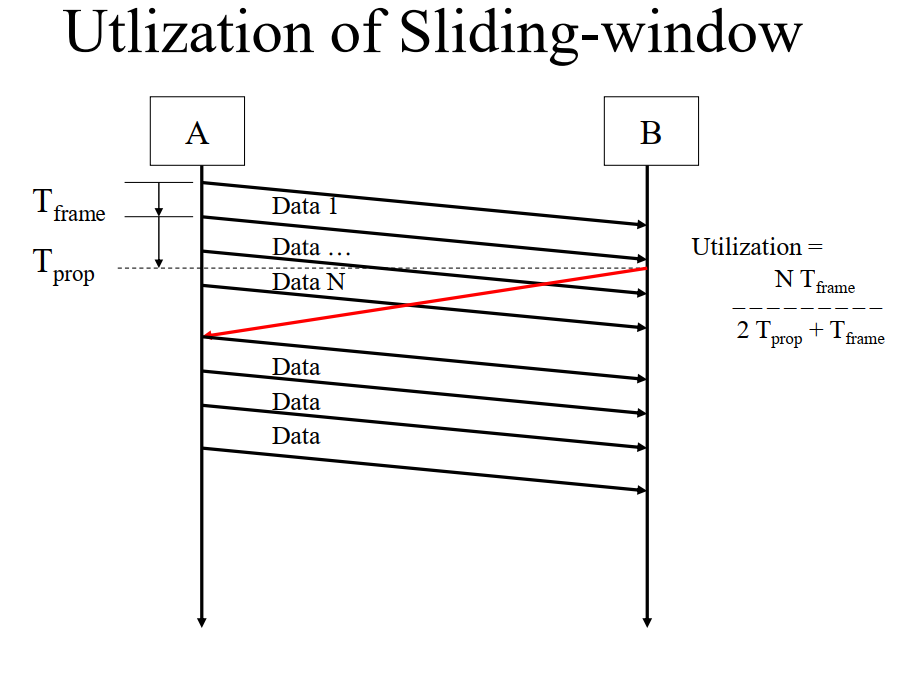

当发生错误时，丢弃错误帧后所有的帧，不发回确认，要求发送方重传开始错误之后的帧

发送方窗口 > 1， 接收方窗口 = 1   且发送窗口的大小W_SIZE <= 最大序列号MAX_SEQ

- 若使用$n$比特编号，则发送方窗口尺寸的范围应该是$1<=SIZE<=2^n-1$
- 当W_SIZE = 8, MAX_SEQ = 7时，是非法的，即存在一种特殊情况，当发送方发送完了0\~7号的数据包后，接收方收到了0\~7帧，但是确认帧全都丢失，于是发送方重传，但是此时接收方就不知道这些帧是新的数据帧还是旧的数据帧了。
- 即在后退N协议中，序列号的数量最少应该是W_SIZE + 1
- 对于窗口大小为$n$的滑动窗口，最多可以有$n-1$帧已发送但没有确认

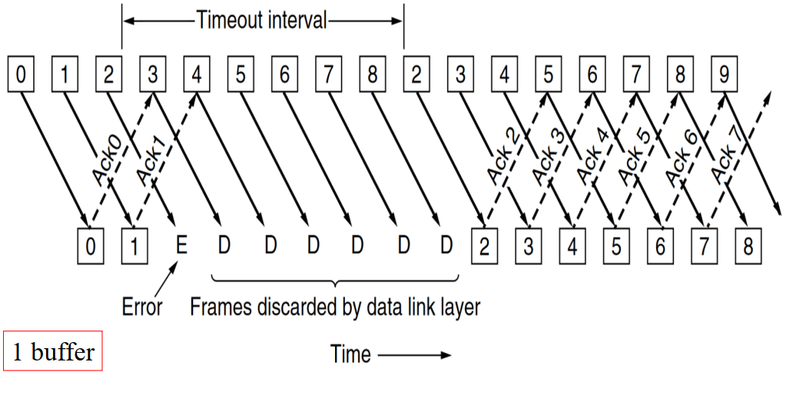

#### Selective Repeat Protocol

发送方窗口 > 1， 接收方窗口 > 1

为了保证没有序号重叠，窗口的最大尺寸不应该超过序号空间的一半，即W_SIZE <= (MAX_SEQ+1)/2

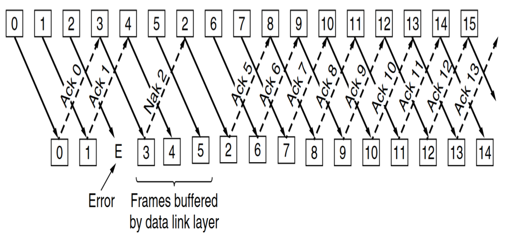

### PPP

A standard protocol called PPP (Point to Point Protocol) is used to ***send packets over the links***, including the SONET fiber optic links and ADSL links.

PPP的特性：

- A framing method that ***unambiguously delineates the end of one frame and the start of the next one***. The frame format also ***handles error detection***. 
- A ***link control protocol*** (链路控制协议, LCP) for bringing lines up, testing them, negotiation options, and bring them down again gracefully when they are no longer needed.
- A way to negotiate network-layer options in a way that is independent of the network layer protocol to be used. The method chosen is to have a different NCP (Network Control Protocol, 网络控制协议) for each network layer supported. 

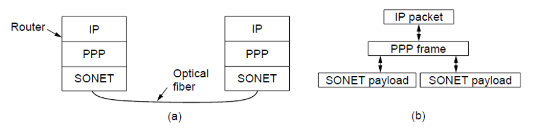