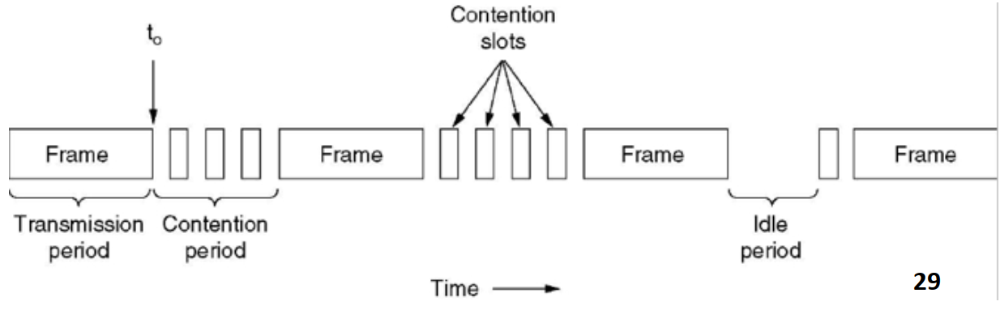
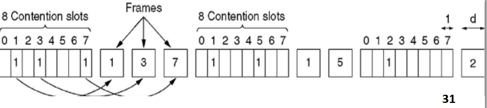
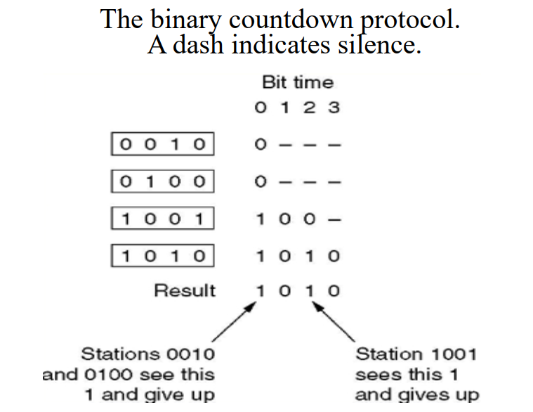
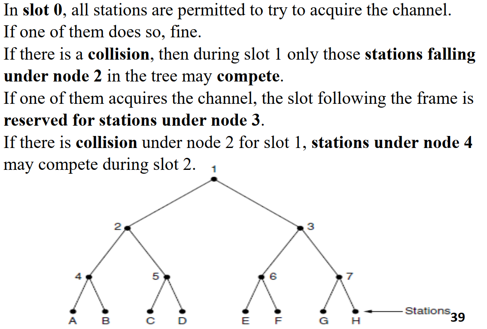
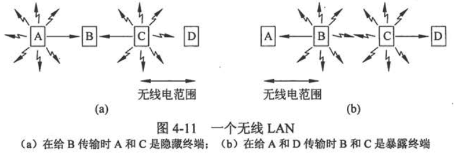
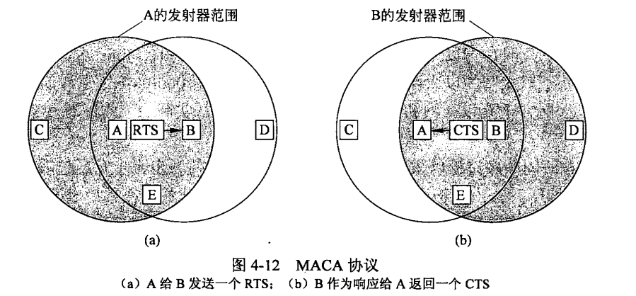
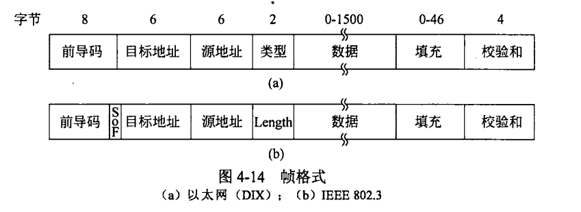

## Chapter4 MAC Layer

##### 网络链路的两大分类

- 点到点连接
- 使用广播信道
    - 多路访问信道 MultiAccess Channel
    - 随机访问信道 Random Access Channel

##### 介质访问控制(MAC, Medium Access Control)： 确定多路访问信道的下一个使用者的协议

### 4.1 信道分配

#### 静态信道分配：

- 可以采用频分多路复用(FDM)或时分多路复用(TDM)，只适合少量用户且固定不变的情况
- 假设信道的容量为C bps，随机到达帧的平均到达率为$\lambda$帧/秒，帧的平均长度为$1/\mu$位，利用这些数据可以算出信道的服务率为$\mu C$帧/秒（信道容量/每帧长度），假设发送一帧所需要的时间延迟为$T$，则$$T=\frac{1}{\mu C-\lambda}$$
- 将单个信道分成N个子信道的时间延迟为NT

#### 动态信道分配的假设

### 4.2 多路访问协议

#### ALOHA：

- Pure ALOHA：
    - 用户有数据要发送时就传输
    - $S=Ge^{-2G}$，最好的信道利用率为18.4%
- Slotted ALOHA：
    - 将时间分成离散的间隔，要求用户遵守统一的时间槽边界
    - $S=Ge^{-G}$

#### 载波侦听多路访问协议（CSMA, Carrier Sense Multiple Access）

- 1-坚持载波检测多路访问(CSMA, Carrier Sense Multiple Access)：

    - 先侦听，有空闲就发送
    - 如果信道忙，则持续侦听
    - 如果发生冲突则等待一段随机的时间
    - 带宽延迟乘积(BD)越大，协议性能越差

- 非坚持CSMA(non persistant CSMA)

    - 如果当前信道正在使用中，则不持续监听，而是随机等待时间，然后重复
    - 信道利用率高，但是延迟大
    - 如果发生冲突则等待一段随机的时间

- p-坚持CSMA(p-persistant CSMA)

    - 侦听信道，如果空闲则以概率p发送数据，以1-p推迟到下一个时间槽
    - 如果忙则持续侦听，等待下一个时间段再重复
    - **IEEE 802.11使用优化的p-CSMA**

- 带冲突检测的CSMA(CSMA/CD, CSMA with Collision Detection)

    - 假设两个最远的站传播的时间需要$\tau$，只有一个站传输了$2\tau$后没监听到冲突，才保证抓到了信道

    

#### 无冲突协议(Collision Free Protocol)

- 基本位图法(Bit Map Protocol)

    - 竞争槽中表示哪个Station需要传输
    - 假设数据长度为d，槽的个数为N。低负载情况下，低序号的站发送需要等待平均1.5N，高序号的站平均等待0.5个槽，对所有站而言平均等待N个槽，即每一帧的额外开销为N位。因此低负载情况下信道利用率为$d/(N+d)$
    - 高负载情况下，N位竞争期被分担到N个帧上，每一帧额外开销1位，利用率位$d/(1+d)$

    

- 令牌传递(Token Passing)

    - Token Ring：环状，向下一个站发送令牌
    - Token Bus：令牌总线，利用总线发送帧

- 二进制倒计数(Binary CountDown)

    - 高序站的优先级高于低序站
    
    - 信道利用率为$d/(d+log_2N)$
    
        

#### 有限竞争协议(Limited-Contention Protocol)

- 自适应树遍历协议(Adaptive Tree Walk Protocol)

    - 二叉树中的叶节点代表Station

    - 某个节点冲突时，只有其左子树下的节点才有竞争权

        

#### 无线局域网协议

- 无线局域网中的站可能无法给所有其他站发送帧，也无法接收来自所有站的其他帧。

- 假设每个无线电发射器有某个固定的传播范围，用圆形覆盖区表示。

- 无线LAN使用CSMA的弊端：

    - ##### 隐藏终端问题(Hidden Station Problem)：由于竞争者离得太远而无法检测到潜在得竞争者，即当A和C同时给B传输时，C不知道A已经发送帧了，所以会在B处产生冲突。

    - ##### 暴露终端问题(Exposed Station Problem)：由于非竞争者离得太近而错误判断，即当B给A发送，C给D发送时，C如果在侦听，则会接收到B的传输而错误地认为不能够发送。

        

- ##### 冲突避免多路访问(MACA, Multiple Access with Collition Avoidance)

    - ##### RTS(Request to Send): 30字节，包含随后要发送地数据帧长度

    - ##### CTS(Clear to Send)：应答帧

        

### 4.3 以太网(802.3)

##### 以太网的分类

- 经典以太网(Classic Ethernet)
- 交换式以太网(Switched Ethernet)

#### 经典以太网的MAC子层协议

- ##### 前导码(Preamble)为8个字节，每个字节包含比特模式10101010(除了最后一个字节为(SOF, 10101011)

- ##### 目标地址和源地址均为6个字节长

    - 如果目标地址第1位是0，表示一个普通地址
    - 如果目标地址第1位是1，则是一个组播(Multicasting)地址
    - 如果目标地址字段全位1，则是广播(Broadcasting)

- ##### 类型(或长度)字段为2个字节，取决于协议类型

- ##### 数据字段最多可以包括1500个字节

- ##### 以太网要求有效帧(从目标地址到校验和)必须至少需要64字节长，因此填充区为0~46字节

    - 限制最小帧长应该满足能够传输2t的时间

- ##### 校验和4字节，一般是32为CRC

    

- ##### 二进制指数后退(Binary Exponential Backoff)的CSMA/CA

    - 在第$i$次冲突后，随机等待$0\to2^i-1$个时间槽，但最大不超过1023
    - 如果只有少量站冲突可以确保较低的延迟，当许多站发生冲突时，可保证一个相对合理的时间解决冲突

- 使用曼彻斯特编码方式
- 交换机每个端口具有独立的冲突域而集线器中所有站位于同一个冲突域

##### 交换机和网桥可以分割冲突域，但是不能分割广播域

- 网桥减少了冲突域增加了广播域

##### 路由器既可以分隔冲突域也可以分隔广播域

- 路由器增加了广播域

##### VLAN能够隔离冲突域和广播域