## Chapter 5 Network Layer

网络层设计思想：

- Store-and-Forward Packet Switching
- Services Provided to the Transport Layer
- Implementation of Connectionless Service
- Implementation of Connection-Oriented Service
- Comparison of Virtual-Circuit and Datagram Subnets

网络层向传输层提供的服务应该：

- 独立于路由器技术
- 屏蔽路由器的数量、类型、拓扑关系
- 传输层可用的网络地址应该有一个统一的编址方案

网络层提供的服务：

- 无连接的服务
    - 所有的数据包被独立地注入到网络中，并且每个数据包独立路由。
    - 在这里数据包被称为数据报(Datagram)。
- 面向连接的服务
    - 要先建立起源路由器到目标路由器的链路，称为虚电路(VC)。

中继系统：

- 物理层：中继器(repeater) 集线器
- 数据链路层：网桥或交换机
- 网络层：路由器
- 网络层以上：网关

路由器的作用：

- Forwarding：To forward the incoming packet according to the routing table
- Routing： To fill in and update the routing table 

最优化原则(Optimality principle): If router J is on the optimal path from router I to router K (I→J→K), then the optimal path from J to K also falls along the same route. 

汇集树(Sink tree): The set of ***optimal routes*** from all sources to a given destination form a tree rooted at the destination. (a) A subnet. (b) A sink tree for router B.

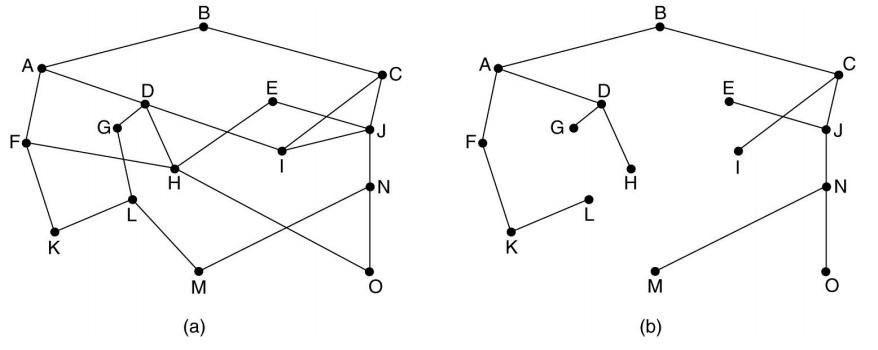

Flooding: Every incoming packet is sent out on every outgoing line ***except the one it arrived on***.

### 路由算法

#### Dijkstra Algorithm

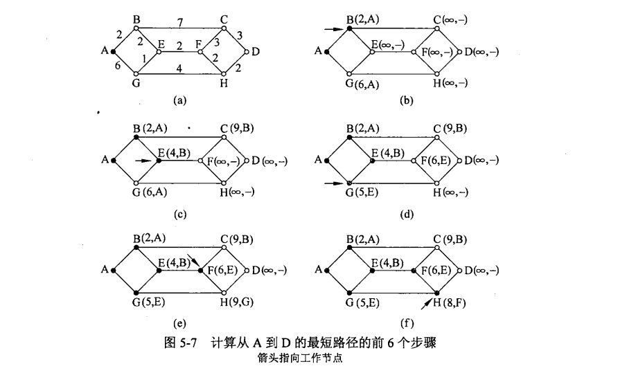

#### Distance Vector Routing(DV, Bellman-Ford Algorithm)

每个路由器维护一张表，以网络中每个路由器为索引，并且每个路由器对应一个表项，该表项包括**到达目标路由器的首选出境线路**以及**到达目标路由器的距离估计值**。

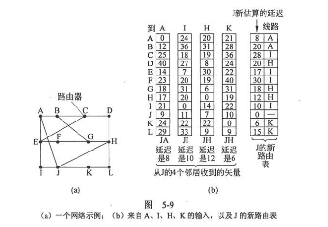

These tables are updated by ***exchanging information with the neighbors***. To update the table, a node: 

- 向每个邻居发送一个列表，该表包含了它到每个目标的延迟估计值
- 从邻居那接收一个类似的表
- 计算新的路由向量

##### 无穷计数(count-to-infinity)问题：

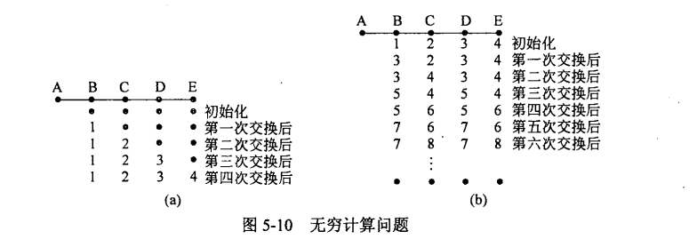

对于图B中值的计算$a[row][col]=min\{a[row-1][col-1],a[row-1][col+1]\}+1$

***Poisoned Reverse：***在基于路由信息协议的网络中，当一条路径信息变为无效之后，路由器并不立即将它从路由表中删除，而是用无穷大，即不可达的度量值将它广播出去。但是它不能完全解决无穷计数问题。

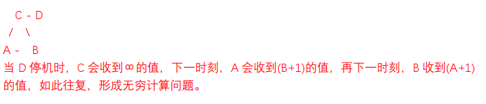

#### Link State Routing(LS Routing)

每个路由器的职责：

- ***Discover its neighbors***, learn their network address.
    - One router sends a special HELLO packet on each point-to-point line. 
- Set the distance or ***cost metric*** to each of its neighbors.
    2. 可通过RTT作为指标
3. ***Construct a packet*** containing all it has just learned.
- ***Send*** this packet to and ***receive*** packets from all other routers.
  - 只有链路状态变化时才会发送数据包
  - Sequence number increments for each new packet sent
  - If packet is new, forward to lines except the incoming one Else (duplicate), discard.
  - If age hits 0, discard the information.
5. ***Compute the shortest path*** to every other router.

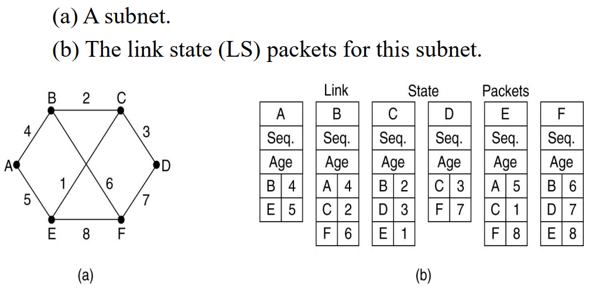

使用LS协议的例子：

- ***IS-IS***
- ***OSPF***

##### LS协议和DV协议的比较：

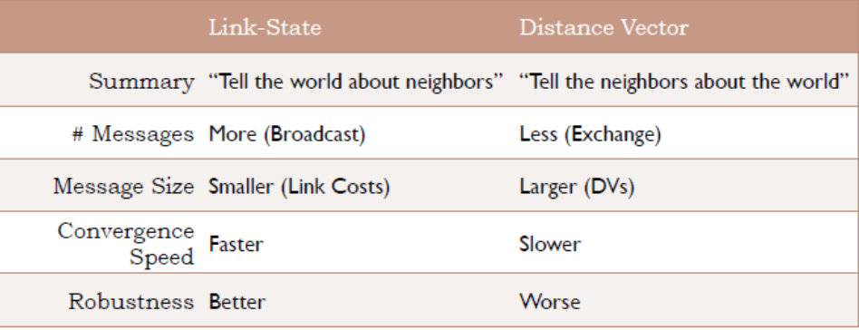

#### Hierarchical Routing

代价是增加路径长度

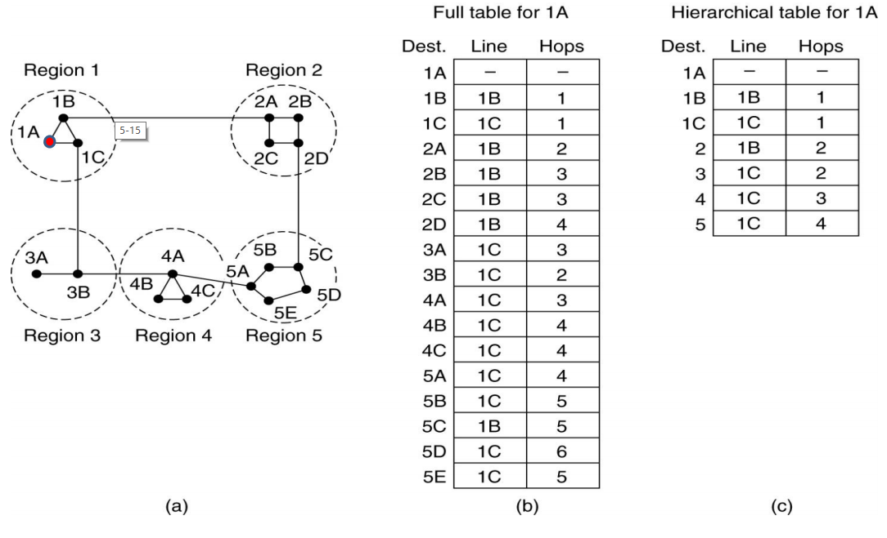

#### Broadcase Routing

Broadcasting：to send a packet to ***all destinations*** ***simultaneously***(同时地).

- ***Multidestination Routing：***每个数据包包含一组目标地址，或者一个位图，由该位图指定所期望到达的目标地址。

- ***Flooding：***当每个源实现了序号，Flooding能够有效利用链路。

- ***Sink-tree based broadcast：*** 最优的传输数据包的方法。

- ***Reverse Path Forwarding：***当一个广播数据包到达一个路由器时，路由器检查它到来的那条线路是否是通常用来给广播源端发送数据包的线路，如果是则将该数据包转发到除了到来的那条线路之外的所有线路上。

    

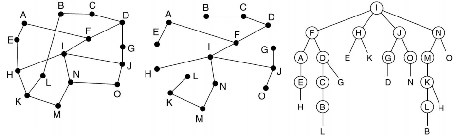

#### Multicast Routing

**Prune the spanning tree**

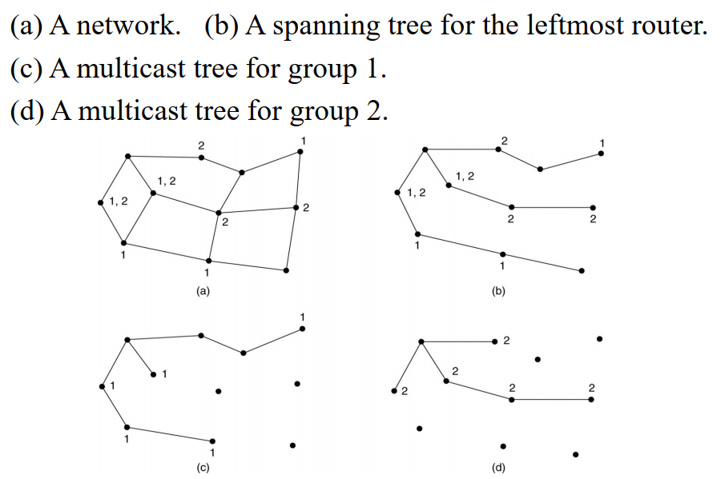

##### Core-Based Tree

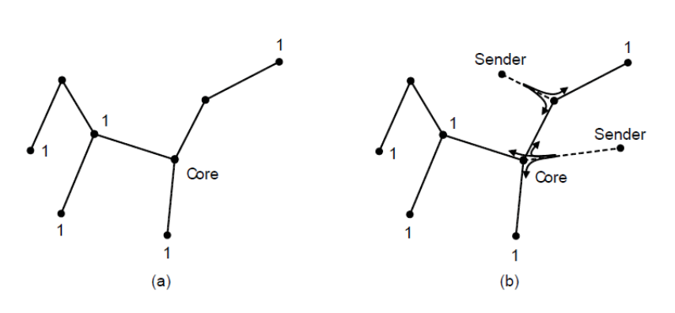

#### Anycast Routing

选播模式下，数据包被传递给最近的一个组成员。

### 网络互连

#### Fragmentation

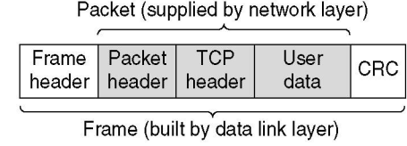

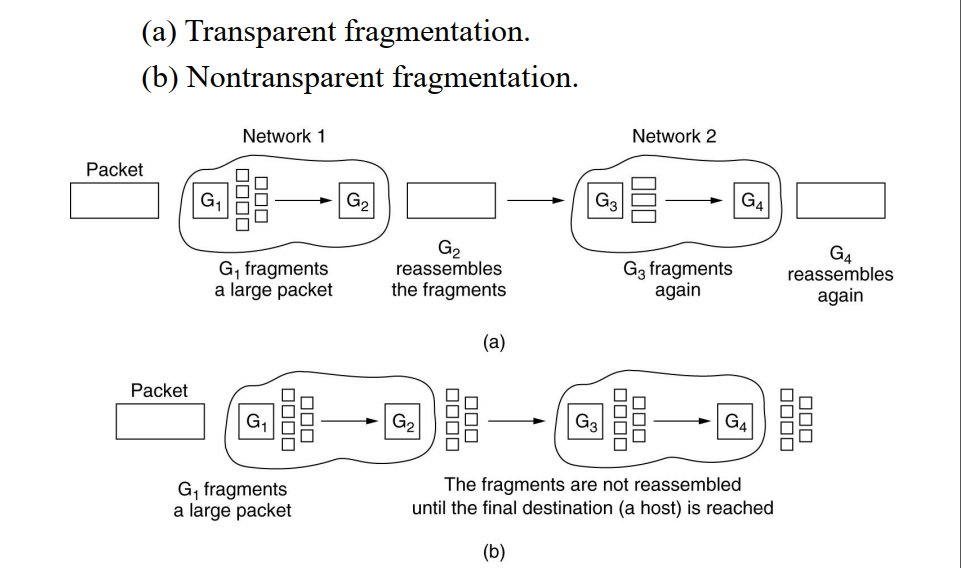

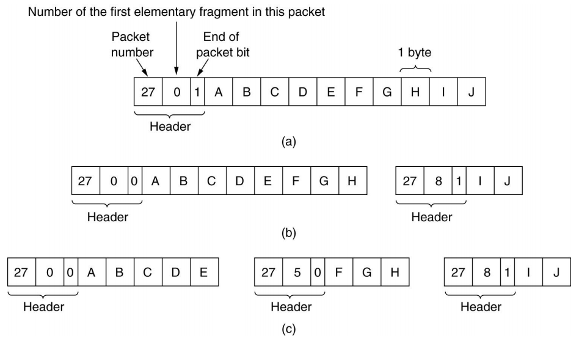

### IPv4协议

##### IP头前一部分长度固定，共20B，最大长度60B(由IHL决定)

##### 头和数据最多不能超过65535个字节

##### 协议字段表示使用的上层协议(TCP为6, UDP为17)，版本字段表示IP的版本(目前为4)

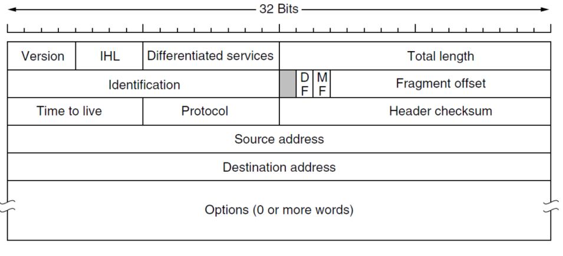

- IHL：指明头有多长，以32位字长度为单位（4字节单位），最小值为5表示没有可选项，该4位字段的长度最大值为15，也就是最大是60字节，因此Option最多为40字节。
- Total length：包含了数据报中的所有内容，**包括头和数据**，最大是65535个字节
- Identification：***Datagram ID***. 主要是为了让目标主机确定一个新到达的分段属于哪个数据报
- DF: 不分段
- MF: 除了最后一个段之外，其他所有的段都必须设置这一位，当***MF=1***时表示后面还有，否则没有。
- Fragment offset: 指明该段在数据包中的位置，由于有13位，因此最多可以***有8192个段***，以8字节为单位
- Protocol：指明将数据包交给哪个传输进程，比如TCP/UDP
- checkSum：**仅校验分组首部，不校验数据**

**注意点：IHL、TOTAL LENGTH、 FRAGMENT OFFSET的单位分别是4B、1B、8B**

#### 地址分类

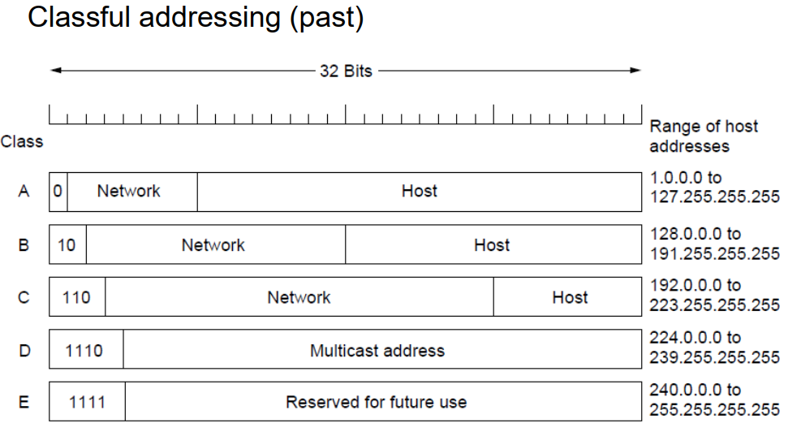

**注意点：**

- 0.0.0.0表示本机
- 127.\*.\*.\*表示回路
- 主机号全1表示广播

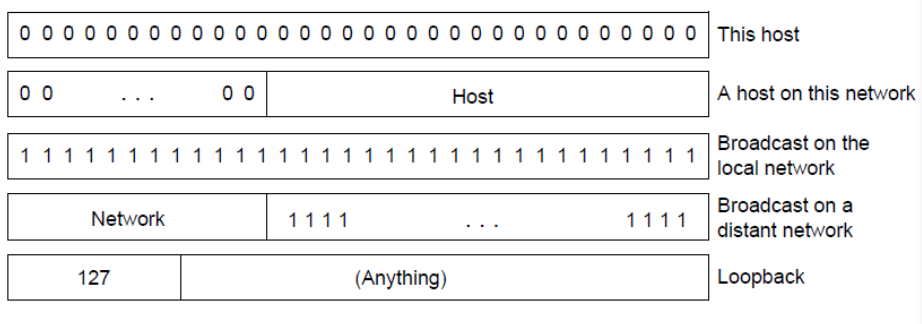

##### CIDR：无类域间路由

##### NAT（需要注意的是，NAT工作在传输层）

- 10.0.0.0/8
    - 10.0.0.0~10.255.255.255
- 172.16.0.0/12
    - 172.16.0.0~172.31.255.255
- 192.168.0.0/16
    - 192.168.0.0~192.168.255.255

### IPv6

- IPV6首部长度是固定不变的，没有校验和字段
- IPV6地址占16个字节，128位
- 有效载荷长度指明了40个字节后还有多少数据，不包括头

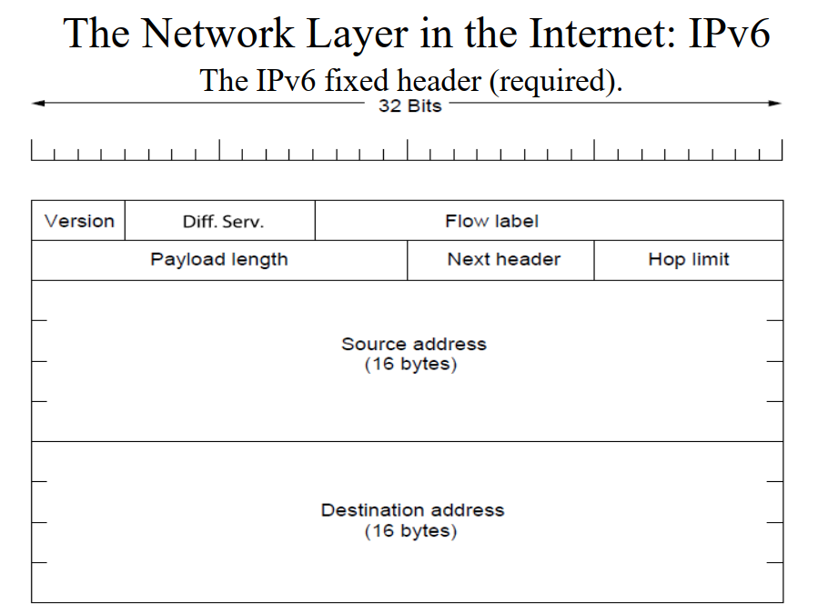

地址写法

- 8000:0000:0000:0000:0123:4567:89AB:CDEF 
- First, leading zeros within a group can be omitted
    - e.g. 0123 can be written as 123 
- Second, one or more groups of 16 zero bits can be replaced by a pair of colons
    - e.g. 8000::123:4567:89AB:CDEF
- IPv4 addresses can be written as a pair of colons and an old dotted decimal number
    - e.g. ::192.31.20.46 

##### Tunneling

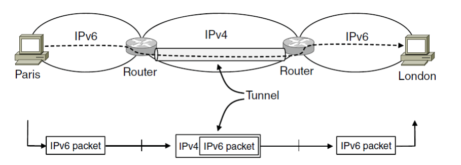

### ICMP协议

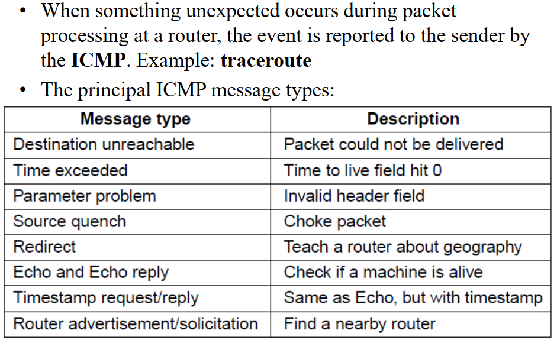

### ARP协议——地址解析协议

- NIC根据48位以太网地址来发送和接收帧
- ARP协议将发送广播包到以太网络上请求拥有IP地址的主机，应答后可以得到以太网地址，且可以在缓冲中找到映射关系，但是缓存会有时间限制

### DHCP协议——动态主机配置协议

### MPLC协议

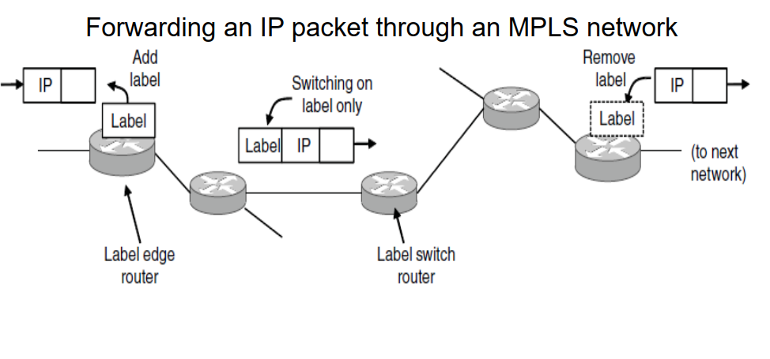

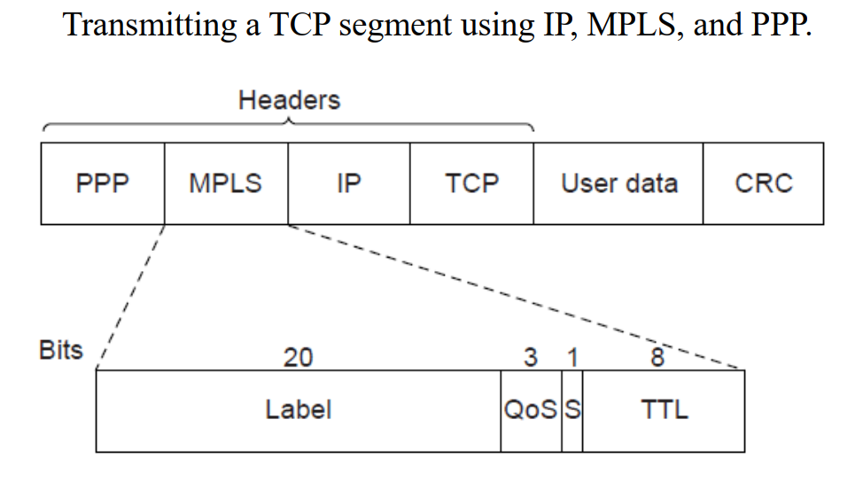

### 内部网关协议(IGP)

#### RIP

- 应用层协议
- 使用DV

#### OSPF

- 网络层协议
- 使用LS

### 外部网关协议(EGP)

#### BGP

